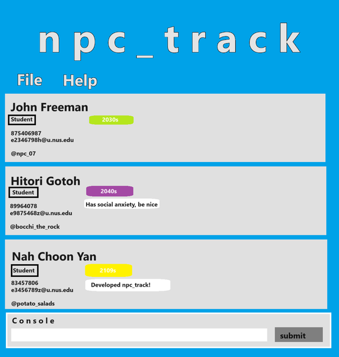

# NPC_TRACK

The only application you need if you're a teaching assistant - free of charge.
It will leave you wondering how you lived without this application all this while.

This project is based on the AddressBook-Level3 project created by the [SE-EDU initiative](https://se-education.org).
