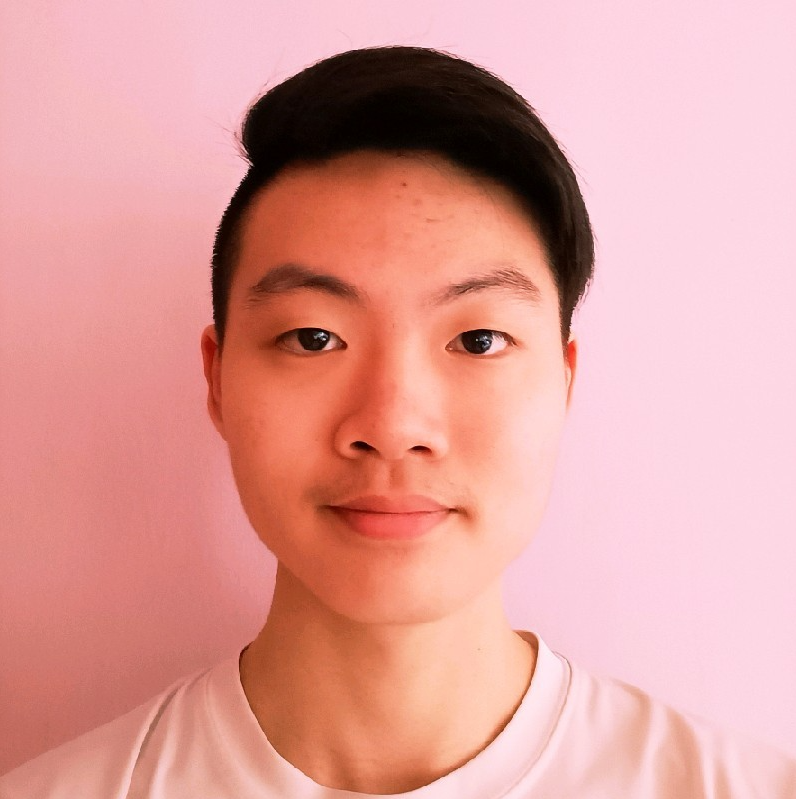
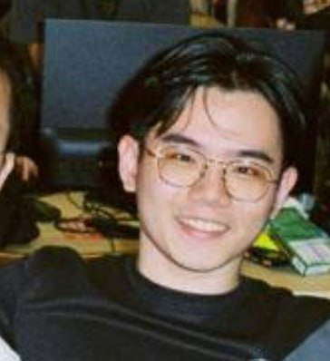
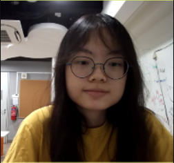

We are a team based in the [School of Computing, National University of Singapore](http://www.comp.nus.edu.sg).

## Project team

### choonyan02

[[github](https://github.com/choonyan02)]
[[portfolio](team/choonyan02.md)]

* Role: Developer
* Responsibilities: Code Quality, Testing and Integration

### et-irl

[[github](http://github.com/et-irl)]
[[portfolio](team/et-irl.md)]

* Role: Developer
* Responsibilities: Code Quality, Testing and Integration

### lsyurea

[[github](http://github.com/lsyurea)] [[portfolio](team/lsyurea.md)]

* Role: Developer
* Responsibilities: Code Quality, Testing and Integration

### proto-aiken-13

[[github](http://github.com/proto-aiken-13)]
[[portfolio](team/proto-aiken-13.md)]

* Role: Developer
* Responsibilities: Code Quality, Testing and Integration

### vanessamae23

[[github](http://github.com/vanessamae23)]
[[portfolio](team/vanessamae23.md)]

* Role: Developer
* Responsibilities: Code Quality, Testing and Integration
