* Table of Contents
{:toc}

--------------------------------------------------------------------------------------------------------------------

## **Acknowledgements**

* [AddressBook Level-3](https://se-education.org/addressbook-level3/)
* [Past Year Teams' Reference](https://github.com/AY2223S1-CS2103T-W17-2/tp/blob/master/docs/DeveloperGuide.md)
* [Past Year Teams' Reference](https://ay2223s1-cs2103t-t12-1.github.io/tp/DeveloperGuide.html)

--------------------------------------------------------------------------------------------------------------------

## **Demo video**

Watch the demo [here.](https://www.youtube.com/watch?v=EblMcXC3lXk)

--------------------------------------------------------------------------------------------------------------------

## **Setting up, getting started**

Refer to the guide [_Setting up and getting started_](SettingUp.md).

--------------------------------------------------------------------------------------------------------------------

## **Design**

:bulb: **Tip:** The `.puml` files used to create diagrams in this document `docs/diagrams` folder. Refer to the [_PlantUML Tutorial_ at se-edu/guides](https://se-education.org/guides/tutorials/plantUml.html) to learn how to create and edit diagrams.

### Architecture

The ***Architecture Diagram*** given above explains the high-level design of the App.

Given below is a quick overview of main components and how they interact with each other.

**Main components of the architecture**

**`Main`** (consisting of classes [`Main`](https://github.com/se-edu/addressbook-level3/tree/master/src/main/java/seedu/address/Main.java) and [`MainApp`](https://github.com/se-edu/addressbook-level3/tree/master/src/main/java/seedu/address/MainApp.java)) is in charge of the app launch and
shut down.
* At app launch, it initializes the other components in the correct sequence, and connects them up with each other.
* At shut down, it shuts down the other components and invokes cleanup methods where necessary.

The bulk of the app's work is done by the following four components:

* [**`UI`**](#ui-component): The UI of the App.
* [**`Logic`**](#logic-component): The command executor.
* [**`Model`**](#model-component): Holds the data of the App in memory.
* [**`Storage`**](#storage-component): Reads data from, and writes data to, the hard disk.

[**`Commons`**](#common-classes) represents a collection of classes used by multiple other components.

**How the architecture components interact with each other**

The *Sequence Diagram* below shows how the components interact with each other for the scenario where the user issues the command `delete 1`.

Each of the four main components (also shown in the diagram above),

* defines its *API* in an `interface` with the same name as the Component.
* implements its functionality using a concrete `{Component Name}Manager` class (which follows the corresponding API `interface` mentioned in the previous point.

For example, the `Logic` component defines its API in the `Logic.java` interface and implements its functionality using the `LogicManager.java` class which follows the `Logic` interface. Other components interact with a given component through its interface rather than the concrete class (reason: to prevent outside component's being coupled to the implementation of a component), as illustrated in the (partial) class diagram below.

The sections below give more details of each component.

### UI component

The **API** of this component is specified in [`Ui.java`](https://github.com/se-edu/addressbook-level3/tree/master/src/main/java/seedu/address/ui/Ui.java)

The UI consists of a `MainWindow` that is made up of parts e.g.`CommandBox`, `ResultDisplay`, `PersonListPanel`, `StatusBarFooter` etc. All these, including the `MainWindow`, inherit from the abstract `UiPart` class which captures the commonalities between classes that represent parts of the visible GUI.

The `UI` component uses the JavaFx UI framework. The layout of these UI parts are defined in matching `.fxml` files
that are in the `src/main/resources/view` folder. For example, the layout of the [`MainWindow`](https://github.com/se-edu/addressbook-level3/tree/master/src/main/java/seedu/address/ui/MainWindow.java) is specified in [`MainWindow.fxml`](https://github.com/se-edu/addressbook-level3/tree/master/src/main/resources/view/MainWindow.fxml)

The `UI` component,

* executes user commands using the `Logic` component.
* listens for changes to `Model` data so that the UI can be updated with the modified data.
* keeps a reference to the `Logic` component, because the `UI` relies on the `Logic` to execute commands.
* depends on some classes in the `Model` component, as it displays `Person` object residing in the `Model`.

### Logic component

**API** : [`Logic.java`](https://github.com/se-edu/addressbook-level3/tree/master/src/main/java/seedu/address/logic/Logic.java)

Here's a (partial) class diagram of the `Logic` component:

The sequence diagram below illustrates the interactions within the `Logic` component, taking `execute("delete 1")` API call as an example.

:information_source: **Note:** The lifeline for `DeleteCommandParser` should end at the destroy marker (X) but due to a limitation of PlantUML, the lifeline reaches the end of diagram.

How the `Logic` component works:

1. When `Logic` is called upon to execute a command, it is passed to an `AddressBookParser` object which in turn creates a parser that matches the command (e.g., `DeleteCommandParser`) and uses it to parse the command.
1. This results in a `Command` object (more precisely, an object of one of its subclasses e.g., `DeleteCommand`) which is executed by the `LogicManager`.
1. The command can communicate with the `Model` when it is executed (e.g. to delete a person).
1. The result of the command execution is encapsulated as a `CommandResult` object which is returned back from `Logic`.

Here are the other classes in `Logic` (omitted from the class diagram above) that are used for parsing a user command:

How the parsing works:
* When called upon to parse a user command, the `AddressBookParser` class creates an `XYZCommandParser` (`XYZ` is a placeholder for the specific command name e.g., `AddCommandParser`) which uses the other classes shown above to parse the user command and create a `XYZCommand` object (e.g., `AddCommand`) which the `AddressBookParser` returns back as a `Command` object.
* All `XYZCommandParser` classes (e.g., `AddCommandParser`, `DeleteCommandParser`, ...) inherit from the `Parser` interface so that they can be treated similarly where possible e.g, during testing.

### Model component
**API** : [`Model.java`](https://github.com/se-edu/addressbook-level3/tree/master/src/main/java/seedu/address/model/Model.java)

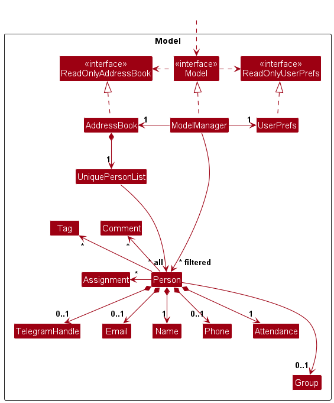

The `Model` component,

* stores the student's data i.e., all `Person` objects (which are contained in a `UniquePersonList` object).
* stores the currently 'selected' `Person` objects (e.g., results of a search query) as a separate _filtered_ list which is exposed to outsiders as an unmodifiable `ObservableList<Person>` that can be 'observed' e.g. the UI can be bound to this list so that the UI automatically updates when the data in the list change.
* stores a `UserPref` object that represents the user’s preferences. This is exposed to the outside as a `ReadOnlyUserPref` objects.
* does not depend on any of the other three components (as the `Model` represents data entities of the domain, they should make sense on their own without depending on other components)

:information_source: **Note:** An alternative (arguably, a more OOP) model is given below. It has a `Tag` list in the `AddressBook`, which `Person` references. This allows `AddressBook` to only require one `Tag` object per unique tag, instead of each `Person` needing their own `Tag` objects. 

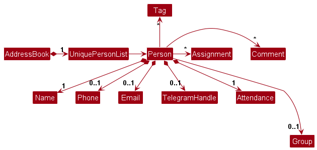

### Storage component

**API** : [`Storage.java`](https://github.com/se-edu/addressbook-level3/tree/master/src/main/java/seedu/address/storage/Storage.java)

The `Storage` component,
* can save both address book data and user preference data in JSON format, and read them back into corresponding objects.
* inherits from both `AddressBookStorage` and `UserPrefStorage`, which means it can be treated as either one (if only the functionality of only one is needed).
* depends on some classes in the `Model` component (because the `Storage` component's job is to save/retrieve objects that belong to the `Model`)

### Common classes

Classes used by multiple components are in the `seedu.addressbook.commons` package.

--------------------------------------------------------------------------------------------------------------------

## **Implementation**

This section describes some noteworthy details on how certain features are implemented.

### Assignment Distribution Feature

#### Implementation
An instance of an `Assignment` is handled by `Assignment.java`. It holds a `name`, `score` and `maxScore`.

Each `Person` will contain `assignments` in the form of a `Set<Assignment>`. We can modify the `Person`'s `Assignment`s by using the following implemented operations by `Assignment`.

* `Assignment#setScore()` - sets the `score` of the assignment, which should be less than `maxScore`.
* `Assignment#setMaxScore()` - sets the `maxScore` of the assignment, which should be more than `0`.

We can give an `Assignment` to everybody in the address book, through the `AssignmentCommand`.
The `AssignmentCommand` looks through all the `Person`s, and attempts to add the `Assignment` to each `Person`.

Below is the sequence diagram for an assignment command.

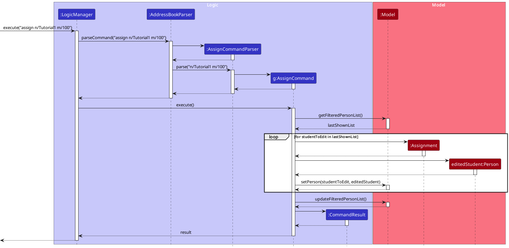

#### Design considerations:

**Aspect: Who to give assignment to by default**

* **Alternative 1 (current choice):** Give it to everybody in the address book.
  * Pros: Easy to implement.
  * Cons: If a new person is added, they will not have an assignment.

* **Alternative 2:** Give it to one person, specified by an index.
  itself.
  * Pros: More control and more tailorable to each person.
  * Cons: Troublesome and infeasible at worst for a large address book.

**Aspect: What grade to store in the assignment**

* **Alternative 1 (current choice):** A score, out of a maximum score.
  * Pros: Easy to implement and universally understood.
  * Cons: Grades, or work without scores are unsupported.

* **Alternative 2:** A complete or incomplete basis.
  * Pros: Easy to implement.
  * Cons: Inflexible, and may not apply to assignments which require scores.

* **Alternative 3:** A grade to represent the performance.
  * Pros: Easy to implement.
  * Cons: Not universally understood, certain letters may mean different things to people.
  For example, S in Japan could be amazing, but not as ideal in Singapore.

### Assignment Group Distribution Feature

#### Implementation
The implementation is an extension of Assignment Distribution Feature in recognition of the
possible limitation of giving assignment to everyone. 

Instead, we can give an `Assignment` to a group of people, through the `AssignmentGroupCommand`.
The `AssignmentGroupCommand` looks through all the `Person`s in the same group, and attempts to add the `Assignment` to each `Person` 
in the group.

#### Design considerations:

**Aspect: Which group to give assignment to by default**

* **Alternative 1 (current choice):** Give it to a group of people, specified by the exact full group name.
  * Pros: Reduced Chance of Error: Gives users the exact group they want to assign and reduces chances of error since it needs
    to be exact match.
  * Cons: Troublesome for the user to type the full group name.

* **Alternative 2:** Give it to a group of people, specified by its prefix.
    * Pros: Reduced Chance of Error: Easier to be used by users as they can just input a partial part of their group name to be able to assign
      to list of students in the same group.
    * Cons: Higher Chance of Error: Since it is more complex and multiple group name may contain the same prefix, it has higher chance of error.

The activity diagram of the parser shows the flow of the final implementation of assigning to a group of students.

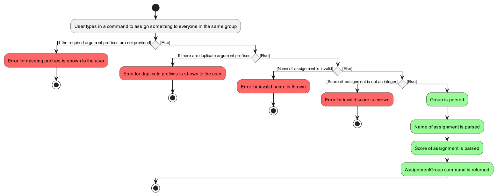

### Mark Attendance

#### Implementation

Mark attendance command is handled by MarkAttendanceCommand, MarkAttendanceParser, and Model.
* `MarkAttendanceParser`: Parse user inputs.
* `MarkAttendanceCommand`: Given the parsed user input, execute the command.
* `Model`: Updates the student list accordingly.

Below is the sequence diagram for marking of a students tutorial attendance.

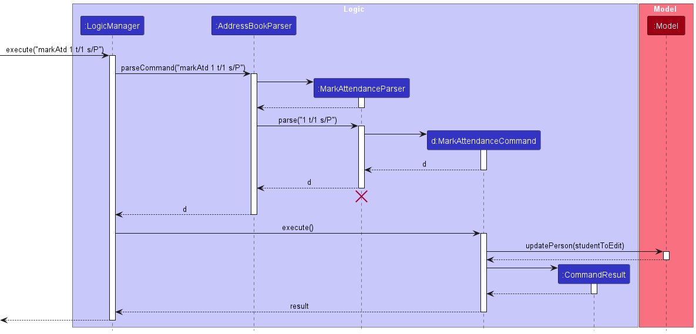

#### Design considerations

**Aspect: How should we mark the attendance?**
* **Alternative 1 (Chosen): 4 Status (Present, Valid Reasons, Absent, and Unmarked)**
  * Pros: Provides more detailed and granular information about the students' attendance status.
  * Pros: Allows for the recognition of valid reasons for missing a class.
  * Cons: The system with four status options may be more complex to implement and manage.
* **Alternative 2: Only 2 status (Present, Absent)**
  * Pros: It simplifies the attendance tracking system, making it easier to implement and use.
  * Cons:  It lacks the ability to differentiate between different reasons for absences.

The activity diagram shows the flow of how the final implementation of marking attendance has been implemented:

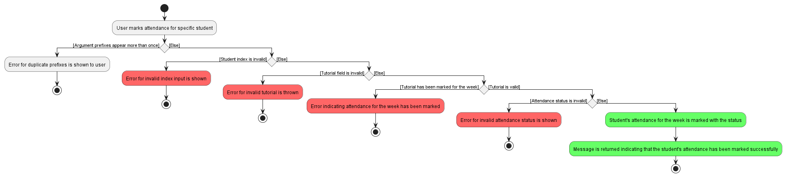

### Input Participation Points

#### Implementation

Input participation command is handled by InputParticipationCommand, InputParticipationParser, and Model.
* `InputParticipationParser`: Parse user inputs.
* `InputParticipationCommand`: Given the parsed user input, execute the command.
* `Model`: Updates the student list accordingly.

Below is the sequence diagram for inputting participation points of a student.

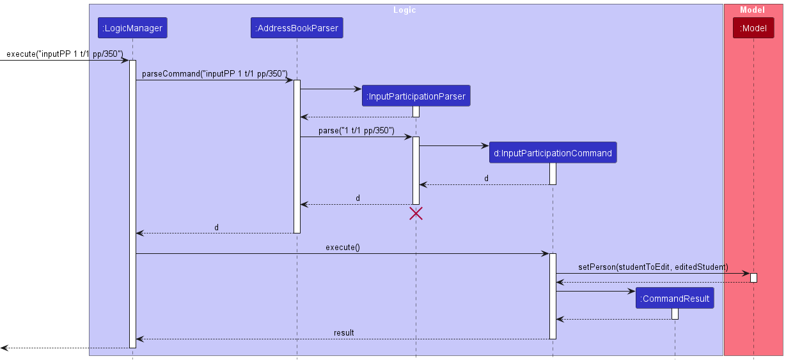

#### Design considerations

**Aspect: How to handle cases where TA attempts to add participation points for unmarked tutorial**
* **Alternative 1 (Chosen):** `npc_track` will output message telling user to mark attendance first.
  * Pros: Prevents Errors: It reduces the chances of errors and inconsistencies in the data,
  as participation points should only be added after attendance is marked.
  * Cons: Potential Delay: If marking attendance and adding participation points are time-sensitive actions,
  requiring the user to mark attendance first may cause a slight delay in the participation point entry process.

* **Alternative 2:** `npc_track` allows participation points to be input regardless of the attendance for that tutorial.
  * Pros: Reduced User Friction: By avoiding strict dependencies, users may experience less friction when interacting
  with the system, potentially leading to a smoother user experience.
  * Cons: Data Inconsistencies: Allowing participation points without ensuring attendance may lead to
  data inconsistencies. For example, TAs might accidentally skip marking attendance and input participation points,
  causing inaccuracies in student records.

The activity diagram shows the flow of how the final implementation of inputting participation has been implemented:

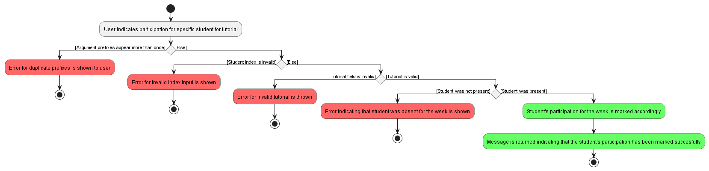

### Find Students

#### Implementation

Find Student command is handled by FindCommand, FindCommandParser, and Model.
* `FindCommandParser`: Parse user inputs.
* `FindCommand`: Given the parsed user input, execute the command.
* `Model`: Updates the student list according to the keyword that the user keys in.

Below is the sequence diagram for finding students.

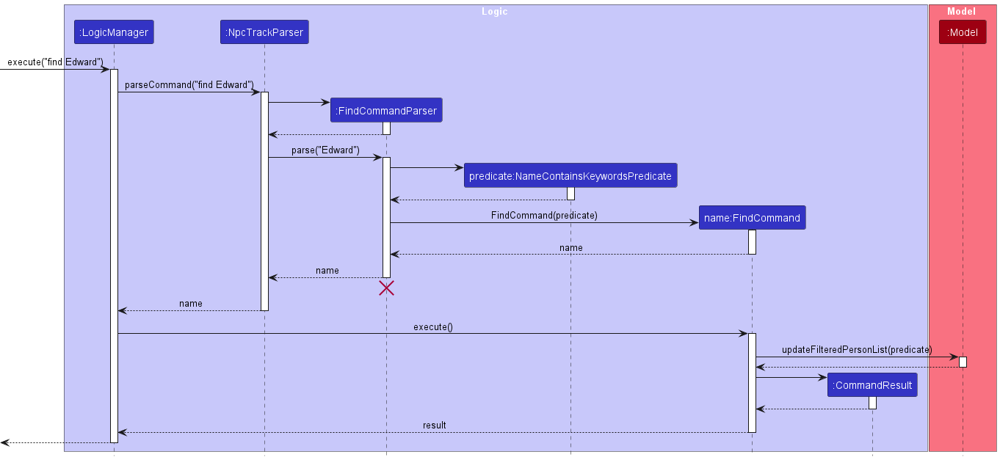

#### Design considerations

**Aspect: Allowing teaching assistants to find using what keyword**
* **Alternative 1 (Chosen):** `npc_track` will output students based on what TA exactly input.
    * Pros: Reduced Chance of Error: Gives users the exact student they want and reduces chances of error since it needs 
      to be exact match.
    * Cons: Increased Complexity: Users need to know the exact name of their student, or else they will not be able 
      to find the student.

* **Alternative 2:** `npc_track` allows users to find just a part of the student's name.
    * Pros: Better User Experience: Users can just input a partial part of their name to be able to find and get a 
      list of students that contain a part of the keyword
    * Cons: Increased Chance of Error: Since it is more complex, there is higher chance of error.

### Find Group of Students

#### Implementation
Find Group of Students command is handled by FindGroupCommand, FindGroupCommandParser, and Model.
* `FindGroupCommandParser`: Parse user inputs.
* `FindGroupCommand`: Given the parsed user input, execute the command.
* `Model`: Updates the student list according to the keyword that the user keys in.

Below is the sequence diagram for finding a group of students.

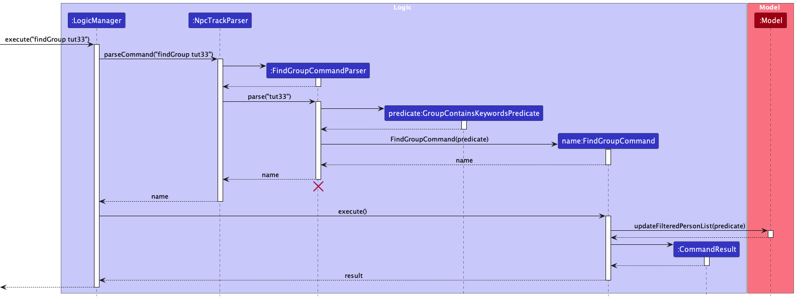

#### Design considerations

**Aspect: Allowing teaching assistants to find group using what keyword**

* **Alternative 1 (Chosen):** `npc_track` will output the group of students based on what TA exactly input for the particular group.
    * Pros: Reduced Chance of Error: Gives users the exact group of students they want and reduces chances of error since it needs 
      to be exact match to the group name.
    * Cons: Increased Complexity: Users need to know the exact name of the group, or else they will not be able 
      to find the group of students.

* **Alternative 2:** `npc_track` allows users to find the group of students using just a part of the group's name.
    * Pros: Better User Experience: Users can just input a partial part of their group name to be able to find and get a 
       list of students in the same group that contain a part of the keyword
    * Cons: Increased Chance of Error: Since it is more complex, there is higher chance of error.

### Grade Students

#### Implementation

Grade Student command is handled by GradeCommand, GradeCommandParser, Assignment, Person and Model.
* `GradeCommandParser`: Parse user inputs.
* `GradeCommand`: Given the parsed user input, execute the command.
* `Model`: Updates the student list according to the keyword that the user keys in.
* `Person`: Updates the particular Person model to change the grade to.
* `Assignment`: Updates the student's assignment grade.

Below is the activity diagram for parsing an assignment command.

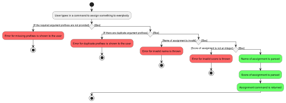

Below is the sequence diagram for grading students.

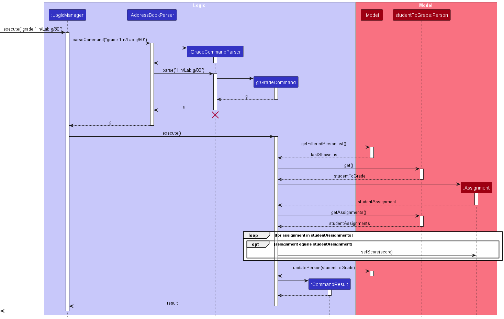

### \[Proposed\] Undo/redo feature

#### Proposed Implementation

The proposed undo/redo mechanism is facilitated by `VersionedAddressBook`. It extends `AddressBook` with an undo/redo history, stored internally as an `addressBookStateList` and `currentStatePointer`. Additionally, it implements the following operations:

* `VersionedAddressBook#commit()` — Saves the current address book state in its history.
* `VersionedAddressBook#undo()` — Restores the previous address book state from its history.
* `VersionedAddressBook#redo()` — Restores a previously undone address book state from its history.

These operations are exposed in the `Model` interface as `Model#commitAddressBook()`, `Model#undoAddressBook()` and `Model#redoAddressBook()` respectively.

Given below is an example usage scenario and how the undo/redo mechanism behaves at each step.

Step 1. The user launches the application for the first time. The `VersionedAddressBook` will be initialized with the initial address book state, and the `currentStatePointer` pointing to that single address book state.

Step 2. The user executes `delete 5` command to delete the 5th person in the address book. The `delete` command calls `Model#commitAddressBook()`, causing the modified state of the address book after the `delete 5` command executes to be saved in the `addressBookStateList`, and the `currentStatePointer` is shifted to the newly inserted address book state.

Step 3. The user executes `add n/David …​` to add a new person. The `add` command also calls `Model#commitAddressBook
()`, causing another modified address book state to be saved into the `addressBookStateList`.

:information_source: **Note:** If a command fails its execution, it will not call `Model#commitAddressBook()`, so the address book state will not be saved into the `addressBookStateList`.

Step 4. The user now decides that adding the person was a mistake, and decides to undo that action by executing the `undo` command. The `undo` command will call `Model#undoAddressBook()`, which will shift the `currentStatePointer` once to the left, pointing it to the previous address book state, and restores the address book to that state.

:information_source: **Note:** If the `currentStatePointer` is at index 0, pointing to the initial AddressBook state, then there are no previous AddressBook states to restore. The `undo` command uses `Model#canUndoAddressBook()` to check if this is the case. If so, it will return an error to the user rather
than attempting to perform the undo.

The following sequence diagram shows how the undo operation works:

:information_source: **Note:** The lifeline for `UndoCommand` should end at the destroy marker (X) but due to a limitation of PlantUML, the lifeline reaches the end of diagram.

The `redo` command does the opposite — it calls `Model#redoAddressBook()`, which shifts the `currentStatePointer` once to the right, pointing to the previously undone state, and restores the address book to that state.

:information_source: **Note:** If the `currentStatePointer` is at index `addressBookStateList.size() - 1`, pointing to the latest address book state, then there are no undone AddressBook states to restore. The `redo` command uses `Model#canRedoAddressBook()` to check if this is the case. If so, it will return an error to the user rather than attempting to perform the redo.

Step 5. The user then decides to execute the command `list`. Commands that do not modify the address book, such as `list`, will usually not call `Model#commitAddressBook()`, `Model#undoAddressBook()` or `Model#redoAddressBook()`. Thus, the `addressBookStateList` remains unchanged.

Step 6. The user executes `clear`, which calls `Model#commitAddressBook()`. Since the `currentStatePointer` is not pointing at the end of the `addressBookStateList`, all address book states after the `currentStatePointer` will be purged. Reason: It no longer makes sense to redo the `add n/David …​` command. This is the behavior that most modern desktop applications follow.

The following activity diagram summarizes what happens when a user executes a new command:

#### Design considerations:

**Aspect: How undo & redo executes:**

* **Alternative 1 (current choice):** Saves the entire address book.
  * Pros: Easy to implement.
  * Cons: May have performance issues in terms of memory usage.

* **Alternative 2:** Individual command knows how to undo/redo by
  itself.
  * Pros: Will use less memory (e.g. for `delete`, just save the person being deleted).
  * Cons: We must ensure that the implementation of each individual command are correct.

_{more aspects and alternatives to be added}_

### \[Proposed\] Data archiving

_{Explain here how the data archiving feature will be implemented}_

--------------------------------------------------------------------------------------------------------------------

## **Documentation, logging, testing, configuration, dev-ops**

* [Documentation guide](Documentation.md)
* [Testing guide](Testing.md)
* [Logging guide](Logging.md)
* [Configuration guide](Configuration.md)
* [DevOps guide](DevOps.md)

--------------------------------------------------------------------------------------------------------------------

## **Appendix: Requirements**

### Product scope

**Target user profile**:

* teaching assistant at NUS
* has a need to manage a significant number of students
* prefer desktop apps over other types
* can type fast
* prefers typing to mouse interactions
* is reasonably comfortable using CLI apps

**Value proposition**: our app offers teaching assistants an efficient solution to student management. It provides quick
access to student details, course organisation, and secure data handling. Communication logs, customization, and
integration with university systems enhance personalized support. Cross-platform access ensures flexibility, supporting
various teaching activities seamlessly.

### User stories

Priorities: High (must have) - `* * *`, Medium (nice to have) - `* *`, Low (unlikely to have) - `*`

| Priority | As a …​  | I want to …​                        | So that I can…​                                         |
|----------|----------|-------------------------------------|---------------------------------------------------------|
| `* * *`  | new user | see usage instructions              | refer to instructions when I forget how to use the App  |
| `* * *`  | TA       | add students to a class             |                                                         |
| `* * *`  | TA       | delete students from a class        | remove students who are not part of the class anymore   |
| `* * *`  | TA       | find students by keyword            | reduce time taken to locate student details             |
| `* *`    | TA       | hide private contact details        | minimize chance of someone else seeing them by accident |
| `* *`    | TA       | mark and unmark students attendance | track the class participation records                   |
| `* *`    | TA       | list all students in a class        | have an overview of all the students in a class         |
| `*`      | TA       | exit the app                        | close the program                                       |

*{More to be added}*

### Use cases

(For all use cases below, the **System** is the `npc_track` and the **Actor** is the `user`, unless specified otherwise)

**Use case: Add a student**

**MSS**

1.  User requests to add a student.
2.  User provides the name and optional details.
3.  `npc_track` creates a new person entry with the provided optional details.

    Use case ends.

**Extensions**

* 2a. User does not provide the name.

    * 2a1. AddressBook displays an error message and prompts the user to provide missing details.

      Use case resumes at step 2.

**Use case: Mark a student's attendance**

**MSS**

1. User requests to mark the attendance of a specified tutorial for a specified student with a given status.
2. `npc_track` updates the current tutorial attendance of that student as marked with the status.

    Use case ends.

**Extensions**

* 1a. User does not provide the correct index/tutorial/status.
  * 1a1. `npc_track` displays an error message and prompts the user to provide the correct details.

    Use case ends.

* 1b. Student's attendance in question is not marked to begin with.

    Use case ends.

* 1b. User attempts to mark a tutorial that has already been marked.
  * 1b1. `npc_track` displays an error message and informs the user that the tutorial in question has already been marked.

    Use case ends.

*1c. User attempts to update using the unknown status.
  * 1c1. `npc_track` displays an error message and prompts the user to provide a valid status.

    Use case ends.

**Use case: Unmark a student's attendance**

**MSS**

1. User requests to unmark the attendance of a particular tutorial for a particular student.
2. `npc_track` updates the current tutorial attendance of that student as unmarked.

   Use case ends.

**Extensions**

* 1a. User does not provide the correct index/tutorial.
    * 1a1. `npc_track` displays an error message and prompts the user to provide the correct details.

    Use case ends.

**Use case: Input participation points to a students tutorial participation**

**MSS**

1. User requests to input participation points to a students tutorial participation.
2. `npc_track` updates the current tutorials participation point for the student.

**Extensions**

* 1a. User does not provide the correct index/tutorial.
    * 1a1. `npc_track` displays an error message and prompts the user to provide the correct details.

    Use case ends.
* 1b. User was absent for the tutorial.
    * 1b1. `npc_track` displays an error message and tells the user that the student is absent.
	
    Use case ends.

**Use case: List a students participation record**

**MSS**

1. User requests to list the participation record of a specified student.
2. `npc_track` returns a message containing the participation record of the student.

**Extensions**

* 1a. User does not provide the correct index.
    * 1a1. `npc_track` displays an error message and prompts the user to provide the missing details.

    Use case ends.

**Use case: Grade a student's assignment**

**MSS**

1.  User requests to grade the assignment of a particular student.
2.  User provides the student index, assignment name and score.
3.  `npc_track` updates the current assignment of that student according to the mark given.

    Use case ends.

**Extensions**

* 2a. User does not provide the correct index / assignment name / score.

    * 2a1. `npc_track` displays an error message and prompts the user to provide missing details.

* 2b. User provides a score that is outside the valid boundary.
    * 2b1. `npc_track` displays an error message and prompts the user to provide the correct score.
* 2c. User provides an assignment that has not been created.

    * 2c1. `npc_track` displays an error message and prompts the user to provide a valid assignment.

      Use case resumes at step 2.

**Use case: Delete a person**

**MSS**

1.  User requests to list persons
2.  AddressBook shows a list of persons
3.  User requests to delete a specific person in the list
4.  AddressBook deletes the person

    Use case ends.

**Extensions**

* 2a. The list is empty.

  Use case ends.

* 3a. The given index is invalid.

    * 3a1. AddressBook shows an error message.

      Use case resumes at step 2.

**Use case : Edit a person**

**MSS**

1. User requests to Edit persons
2. AddressBook shows the edited person

    Use case ends.

**Use case: Find a person**

**MSS**

1.  User requests to find a person.
2.  User provides the full or partial search keyword.
3.  AddressBook searches for persons matching the keyword.
4.  AddressBook displays a list of matching persons.

    Use case ends.

**Extensions**

* 5a. No persons match the search keyword.

    * 5a1. AddressBook displays a message indicating no matching persons were found.

      Use case ends.

**Use case: Find a group of persons**

**MSS**
1. User requests to find a group of persons.
2. User provides the full or partial search keyword.
3. AddressBook searches for persons matching the keyword.
4. AddressBook displays a list of matching persons.

   Use case ends.

**Extensions**

* 5a. No persons match the search keyword.

    * 5a1. AddressBook displays a message indicating no matching persons were found.

      Use case ends.

**Use case: List all persons**

**MSS**

1.  User requests to list all persons.
2.  AddressBook retrieves the list of all persons.
3.  AddressBook displays a list of all persons.

    Use case ends.

**Extensions**

* 2a. There are no persons in the address book.

    * 2a1. AddressBook displays a message indicating that the address book is empty.

      Use case ends.

**Use case: Change the current groupings**

**MSS**

1. User requests to change the current groupings.
2. User provides the new groupings.
3. AddressBook changes the current groupings.

    Use case ends.

### Non-Functional Requirements

1.  Should work on any _mainstream OS_ as long as it has Java `11` or above installed.
2.  Should be able to hold up to 1000 persons without a noticeable sluggishness in performance for typical usage.
3.  A user with above average typing speed for regular English text (i.e. not code, not system admin commands) should be able to accomplish most of the tasks faster using commands than using the mouse.
4.  Any teaching assistant from any faculty should know how to use it.
5.  Data of the students should not be easily accessible.

*{More to be added}*

### Glossary

* **Mainstream OS**: Windows, Linux, Unix, OS-X
* **Private contact detail**: A contact detail that is not meant to be shared with others
* **CLI**: Command Line Interface
* **GUI**: Graphical User Interface
* **UI**: User Interface
* **TA**: Teaching Assistant
* **MSS**: Main Success Scenario
* **Attendance status**: The attendance status of a student, which can be either present, absent, valid reason (VR) or unknown.

--------------------------------------------------------------------------------------------------------------------

## **Appendix: Instructions for manual testing**

Given below are instructions to test the app manually.

:information_source: **Note:** These instructions only provide a starting point for testers to work on;
testers are expected to do more *exploratory* testing.

### Launch and shutdown

1. Initial launch

   1. Download the jar file and copy into an empty folder

   1. Double-click the jar file Expected: Shows the GUI with a set of sample contacts. The window size may not be optimum.

1. Saving window preferences

   1. Resize the window to an optimum size. Move the window to a different location. Close the window.

   1. Re-launch the app by double-clicking the jar file. 
       Expected: The most recent window size and location is retained.

1. _{ more test cases …​ }_

### Deleting a person

1. Deleting a person while all persons are being shown

   1. Prerequisites: List all persons using the `list` command. Multiple persons in the list.

   1. Test case: `delete 1` 
      Expected: First contact is deleted from the list. Details of the deleted contact shown in the status message. Timestamp in the status bar is updated.

   1. Test case: `delete 0` 
      Expected: No person is deleted. Error details shown in the status message. Status bar remains the same.

   1. Other incorrect delete commands to try: `delete`, `delete x`, `...` (where x is larger than the list size) 
      Expected: Similar to previous.

1. _{ more test cases …​ }_

### Saving data

1. Dealing with missing/corrupted data files

   1. _{explain how to simulate a missing/corrupted file, and the expected behavior}_

1. _{ more test cases …​ }_
