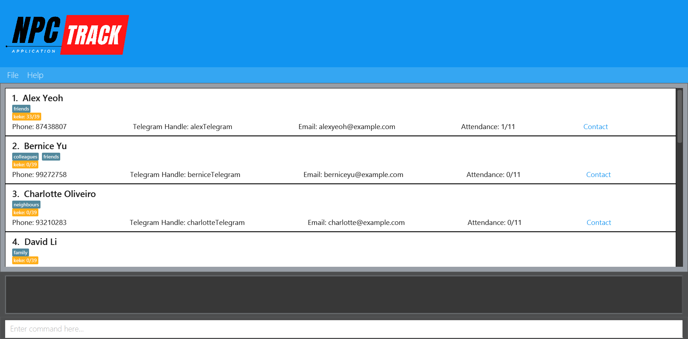
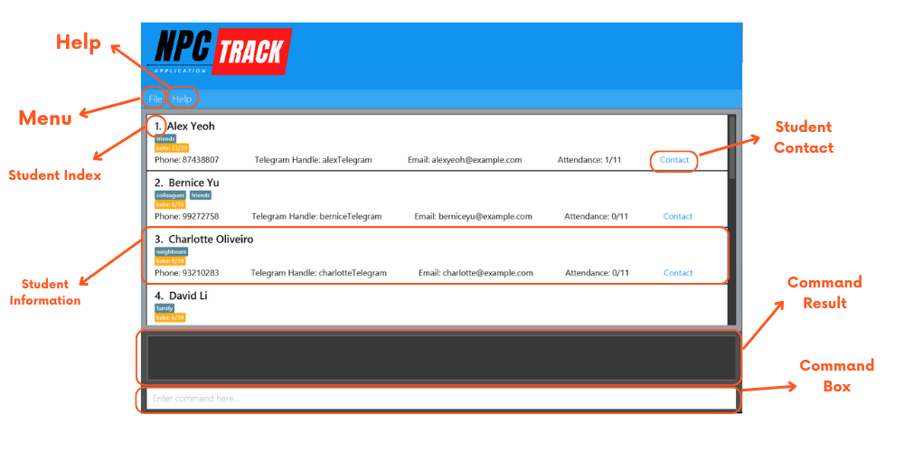

### Tracking the details of your students is on the cusp of your fingertips!

`npc_track` is a desktop application curtailed for the humble teaching assistants of SoC via a Command Line Interface (CLI) while still having the benefits of a Graphical User Interface (GUI). If you can type fast, `npc_track` can get your contact management tasks done faster than traditional GUI apps.

Here’s an overview of how `npc_track` can help you streamline your student management process:
- Store, delete and edit information about your students!
- Track the attendance of your students
- Streamline the grading process of your students
- Manage student groupings in an organized way

On top of these functionalities, we believe that student management should be extremely efficient. `npc_track` is optimized for use via the familiar command line interface (CLI) for linux / fans of terminal applications as well as the benefits of an appealing user interface for TA’s more inclined to them!

### How can `npc_track` help you in your teaching journey?

***`npc_track` is for all TA’s, and is adaptable for their management and organisational styles!***

From a survey that we did on teaching assistants, we found that a majority of them found it difficult and tedious to 
find and organise their student's information. Hence, `npc_track` is specially developed to help these fast typists 
students to be able to streamline the process using ***simple commands*** to do different tasks.

We help teaching assistants to be able to bring together their teaching needs in a hassle-free manner. For instance, 
adding extra information for a student named Ted can easily be done using the various keyword features as listed in 
our [Features Section](#features)

`npc_track` saves teaching assistant from having to spend so much precious time by reducing the complexity and the 
need to 
navigate different platforms just to search their students. Now, it can be done in a one-stop manner using `npc_track`

Not ready to use `npc_track`? Fret Not, you can jump to the [Quick Start](#quick-start) section to begin your 
`npc-track` 
journey

If you have used `npc_track` before, you can proceed to the relevant sections via our [Table of Contents](#toc) on 
the sidebar

### How can this guide help me?

**First time user?** Welcome and thank you for using our app! Check out the installation guide here!

Once you’re done setting up, check out the [features](#features) of `npc_track` to manage the dossier of your students!

If you are an intermediary user and are confused or unclear of some of our features, check out the [FAQ](#FAQ) as well!

Encountered some bugs or unexpected events when using the app? Maybe [Known Issues](#issues) will give you some guidance on what the known bugs (and their status) are!

A seasoned user (but you still need help on memorizing commands)? Drop by in [Command summary](#summary)!

---

[//]: # ()

[//]: # (## Table of Contents)

[//]: # ({:toc})

[//]: # (- [Features]&#40;#features&#41;)

[//]: # (    - [Viewing Help]&#40;#help&#41; `help`)

[//]: # (    - [Adding a Student]&#40;#add&#41; `add`)

[//]: # (    - [Editing a Student]&#40;#edit&#41; `edit`)

[//]: # (    - [Deleting a Student]&#40;#delete&#41; `delete`)

[//]: # (    - [Listing All Students]&#40;#list&#41; `list`)

[//]: # (    - [Finding a Student]&#40;#find&#41; `find`)

[//]: # (    - [Distributing Assignments]&#40;#assign&#41; `assign`)

[//]: # (    - [Grading a Student]&#40;#grade&#41; `grade`)

[//]: # (    - [Marking Attendance]&#40;#markAtd&#41; `markAtd`)

[//]: # (    - [Unmarking Attendance]&#40;#unmarkAtd&#41; `unmarkAtd`)

[//]: # (    - [Exiting the Program]&#40;#exit&#41;)

[//]: # ()
[//]: # (- [FAQ]&#40;#FAQ&#41;)

[//]: # (- [Known Issues]&#40;#issues&#41;)

[//]: # (- [Command Summary]&#40;#summary&#41;)

## Quick start

Step 1 : Ensure you have have downloaded Java version 11 or above in your computer. Steps on how to download [Java](https://www.oracle.com/java/technologies/downloads/#java11)

Step 2 : Navigate to our ... and download the latest JAR file

Step 3 : Save the JAR file to a folder where you want to locate the file
- For Windows Users
- For Mac Users
- For Linux Users

Step 4 : Run the `npc_track`

Step 5 : Start using the app

--------------------------------------------------------------------------------------------------------------------

## Features

**:information_source: Notes about the command format:** 

* Words in `UPPER_CASE` are the parameters to be supplied by the user. 
  e.g. in `add n/NAME`, `NAME` is a parameter which can be used as `add n/John Doe`.

* Items in square brackets are optional. 
  e.g `n/NAME [t/TAG]` can be used as `n/John Doe t/friend` or as `n/John Doe`.

* Items with `…`​ after them can be used multiple times including zero times. 
  e.g. `[t/TAG]…​` can be used as ` ` (i.e. 0 times), `t/friend`, `t/friend t/family` etc.

* Parameters can be in any order. 
  e.g. if the command specifies `n/NAME p/PHONE_NUMBER`, `p/PHONE_NUMBER n/NAME` is also acceptable.

* Extraneous parameters for commands that do not take in parameters (such as `help`, `list`, `exit` and `clear`) will be ignored. 
  e.g. if the command specifies `help 123`, it will be interpreted as `help`.

* If you are using a PDF version of this document, be careful when copying and pasting commands that span multiple lines as space characters surrounding line-breaks may be omitted when copied over to the application.

### Viewing help : `help`

Shows a message explaining how to access the help page.

Format: `help`

### Adding a student: `add`

Adds a student to the student book.

Format: `add n/NAME p/PHONE_NUMBER e/EMAIL a/TELEGRAM_HANDLE [t/TAG]… [c/COMMENT]… [group/GROUP]`

:bulb: **Tip:**
A student can have any number of tags (including 0)

:bulb: **Tip:**
A student can have any number of comments (including 0)

Examples:
* `add n/John Doe p/98765432 e/johnd@example.com a/johnTelegram, block 123, #01-01`
* `add n/Betsy Crowe t/friend e/betsycrowe@example.com a/newTelegram p/1234567 t/criminal c/On the loose as we speak!`
* `add n/James`
* `add n/James group/tut4`

### Listing all students : `list`

Shows a list of all students.

Format: `list`

### Finding students : `find`

Finds students associated with the keyword.

Format: `find KEYWORD [MORE_KEYWORDS]…`

Examples:
*  `find James Jake`

### Editing a person : `edit`

Edits an existing student.

Format: `edit INDEX [n/NAME] [p/PHONE] [e/EMAIL] [t/TAG]… [c/COMMENT]… [a/TELEGRAM_HANDLE] [group/GROUP]`

Examples:
*  `edit 1 p/91234567 e/johndoe@example.com` Edits the phone number and email address of the 1st person to be
   `91234567` and `johndoe@example.com` respectively.
*  `edit 2 n/Betsy Crower t/` Edits the name of the 2nd person to be `Betsy Crower` and clears all existing tags.
*  `edit 3 t/ c/Loves cake` Clears all existing tags of the 3rd person and replaces their tags with "Loves cake".
* `edit 4 group/2` Moves the 4th person to group 2.

### Attendance

For attendance, you can enter the following commands:
* markAtd
* unmarkAtd

### Mark Attendance : `markAtd`

Marks the attendance of a student for that tutorial.

Format: `markAtd INDEX t/TUTORIAL`

Examples:
* `markAtd 1 t/1`
* `markAtd 2 t/12`

### Unmark Attendance : `unmarkAtd`

Unmark the attendance of a student for that tutorial.

Format: `unmarkAtd INDEX t/TUTORIAL`

Examples:
* `unmarkAtd 1 t/1`
* `unmarkAtd 2 t/12`

### Distribute assignments: `assign`

Create an assignment and assign it to all students.

Format: `assign n/ASSIGNMENT_NAME m/MAX_SCORE`

Examples:
- `assign n/Tutorial1 m/100`

### Grade assignments: `grade`

Grade a student's assignment.

Format: `grade INDEX n/ASSIGNMENT_NAME g/SCORE`

Examples:
- `grade 1 n/Tutorial1 g/90`

### Grouping students: `group`

Group students by classes.

Format: `group PREV_GROUP UPDATED_GROUP`

Examples:
- `group 1 2`

### Deleting a student : `delete`

Deletes the specified person from the student book.

Format: `delete INDEX`

### Exiting the program : `exit`

Exits the program.

Format: `exit`

### Saving the data

StudentBook data are saved in the hard disk automatically after any command that changes the data. There is no need to save manually.

### Editing the data file

`npc_track` data are saved automatically as a JSON file. Advanced users are welcome to update data directly by editing that data file.

:exclamation: **Caution:**
If your changes to the data file makes its format invalid, StudentBook will discard all data and start with an empty data file at the next run. Hence, it is recommended to take a backup of the file before editing it.

### Archiving data files `[coming in v2.0]`

_Details coming soon ..._

--------------------------------------------------------------------------------------------------------------------

## Known issues

1. **When using multiple screens**, if you move the application to a secondary screen, and later switch to using only the primary screen, the GUI will open off-screen. The remedy is to delete the `preferences.json` file created by the application before running the application again.

--------------------------------------------------------------------------------------------------------------------

## Navigating `npc_track`

### GUI Interface
Our user-friendly interface allows quick navigation for teaching assistants. Below is an overview of the interface 
followed by a quick summary guide of the Graphical User Interface (GUI)

Component | Function
--------|------------------
**Menu** | Contains a dropdown section to exit `npc_track`
**Help** | A link that leads to the user guide
**Command Result** | The result of the commands that user types in the command box
**Command Box** | A placeholder for users to type the various command as listed in the [Features](#features) section
**Student Information** | A display of the different information regarding the student
**Student Index** | The `INDEX` of the student that users want to change / view

--------------------------

## Command summary

Action | Format, Examples
--------|------------------
**Add** | `add n/NAME p/PHONE_NUMBER e/EMAIL a/TELEGRAM_HANDLE [t/TAG]… [c/COMMENT]…​`   e.g., `add n/James Hop/22224444 e/jamesho@example.com a/jamesTele t/friend t/colleague c/Owes a cookie`
**Clear** | `clear​`
**Delete** | `delete INDEX​`   e.g., `delete 3`
**Distribute Assignments** | `assign n/ASSIGNMENT_NAME m/MAX_SCORE`
**Edit** | `edit INDEX [n/NAME] [p/PHONE] [e/EMAIL] [t/TAG]… [c/COMMENT]…​`   e.g., `n/New Name t/`
**Exit** | `exit​`
**Find** | `find KEYWORD [MORE_KEYWORDS]​` e.g., `find James Jake`
**Grade Assignments** | `grade INDEX n/ASSIGNMENT_NAME g/SCORE`
**Help** | `help​`
**List** | `list​`
**Mark Attendance** | `markAtd INDEX t/TUTORIAL`
**Unmark Attendance** | `unmarkAtd INDEX t/TUTORIAL`
**group** | `group PREV_GROUP UPDATED_GROUP`

--------------------------------------------------------------------------------------------------------------------

## Glossary

Keyword | Definition
--------|------------------
**Parameter** | Details about the student that will be included in the command
**Command** | Instructions that `npc_track` will execute
**Command** | Instructions that `npc_track` will execute

--------------------------------------------------------------------------------------------------------------------

## FAQ

**Q**: How do I transfer my data to another Computer? 
**A**: Install the app in the other computer and overwrite the empty data file it creates with the file that contains the data of your previous StudentBook home folder.
