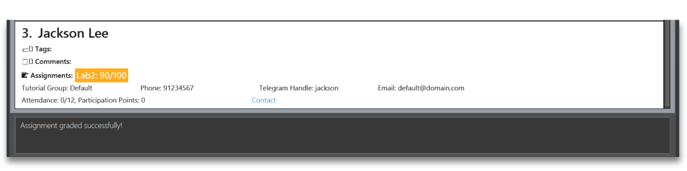

### Tracking the details of your students is on the cusp of your fingertips!

`npc_track` is a desktop application curtailed for the humble teaching assistants of SoC via a Command Line Interface (CLI) while still having the benefits of a Graphical User Interface (GUI). If you can type fast, `npc_track` can get your contact management tasks done faster than traditional GUI apps.

Here’s an overview of how `npc_track` can help you streamline your student management process:
- Store, delete and edit information about your students!
- Track the attendance of your students
- Streamline the grading process of your students
- Manage student groupings in an organized way

On top of these functionalities, we believe that student management should be extremely efficient. `npc_track` is optimized for use via the familiar command line interface (CLI) for linux / fans of terminal applications as well as the benefits of an appealing user interface for TA’s more inclined to them!

### How can `npc_track` help you in your teaching journey?

***`npc_track` is for all TA’s, and is adaptable for their management and organisational styles!***

We help teaching assistants to be able to bring together their teaching needs in a hassle-free manner. For instance, 
adding extra information for a student named Ted can easily be done using the various keyword features as listed in 
our [Features Section](#features)

`npc_track` saves teaching assistant from having to spend so much precious time by reducing the complexity and the 
need to 
navigate different platforms just to search their students. Now, it can be done in a one-stop manner using `npc_track`

Not ready to use `npc_track`? Fret Not, you can jump to the [Quick Start](#quick-start) section to begin your 
`npc-track` 
journey

If you have used `npc_track` before, you can proceed to the relevant sections via our [Table of Contents](#toc) on 
the sidebar

### How can this guide help me?

**First time user?** Welcome and thank you for using our app! Check out the installation guide here!

Once you’re done setting up, check out the [features](#features) of `npc_track` to manage the dossier of your students!

If you are an intermediary user and are confused or unclear of some of our features, check out the [FAQ](#FAQ) as well!

Encountered some bugs or unexpected events when using the app? Maybe [Known Issues](#issues) will give you some guidance on what the known bugs (and their status) are!

A seasoned user (but you still need help on memorizing commands)? Drop by in [Command summary](#summary)!

---

## Table of Contents

{:toc}

- [Features](#features)

    - [Viewing Help](#help) `help`

    - [Adding a Student](#add) `add`

    - [Editing a Student](#edit) `edit`

    - [Deleting a Student](#delete) `delete`

    - [Listing All Students](#list) `list`

    - [Finding a Student](#find) `find`
  
    - [Finding a Group of Students](#findGroup) `findGroup`

    - [Distributing Assignments](#assign) `assign`
  
    - [Distributing Assignments to a Group of Students](#assignGroup) `assignGroup`

    - [Distributing Assignments to an individual](#assignIndiv) `assignIndiv`

    - [Distributing Assignments](#deassign) `deassign`

    - [Grading a Student](#grade) `grade`

    - [Grading a Group of Students](#gradeGroup) `gradeGroup`

    - [Marking Attendance](#markAtd) `markAtd`

    - [Unmarking Attendance](#unmarkAtd) `unmarkAtd`

    - [Marking Attendance for a Group of Students](#markGroupAtd) `markGroupAtd`

    - [Unmarking Attendance for a Group of Students](#unmarkGroupAtd) `unmarkGroupAtd`

    - [Exiting the Program](#exit)

- [FAQ](#FAQ)

- [Known Issues](#issues)

- [Command Summary](#summary)

## Quick start

Step 1 : Ensure you have have downloaded Java version 11 or above in your computer. Steps on how to download [Java](https://www.oracle.com/java/technologies/downloads/#java11)

Step 2 : Navigate to our ... and download the latest JAR file

Step 3 : Save the JAR file to a folder where you want to locate the file
- For Windows Users
- For Mac Users
- For Linux Users

Step 4 : Run the `npc_track`

Step 5 : Start using the app

--------------------------------------------------------------------------------------------------------------------

## Features

**:information_source: Notes about the command format:** 

* Words in `UPPER_CASE` are the parameters to be supplied by the user. 
  e.g. in `add n/NAME`, `NAME` is a parameter which can be used as `add n/John Doe`.

* Items in square brackets are optional. 
  e.g `n/NAME [t/TAG]` can be used as `n/John Doe t/friend` or as `n/John Doe`.

* Items with `…`​ after them can be used multiple times including zero times. 
  e.g. `[t/TAG]…​` can be used as ` ` (i.e. 0 times), `t/friend`, `t/friend t/family` etc.

* Parameters can be in any order. 
  e.g. if the command specifies `n/NAME p/PHONE_NUMBER`, `p/PHONE_NUMBER n/NAME` is also acceptable.

* Extraneous parameters for commands that do not take in parameters (such as `help`, `list`, `exit` and `clear`) will be ignored. 
  e.g. if the command specifies `help 123`, it will be interpreted as `help`.

* If you are using a PDF version of this document, be careful when copying and pasting commands that span multiple lines as space characters surrounding line-breaks may be omitted when copied over to the application.

### Viewing help : `help`

If you have some trouble when using `npc_track`, simply click on the help button on the top right menu bar or type 
the `help` command.

Shows a message displaying the link and a button that navigates to the link directly.

:pencil2: **Purpose:**
Helps user navigate through the app.
  
***Format***: `help`

:pushpin: **Having Problems?**
This is not to worry. You can refer to our [troubleshoot](#issues) guide for common problems. 
***Confused with some terms?*** You can refer to our [glossary](#glossary) to find out.

### ***Adding a student: `add`***

Want to add another student into your student contacts? Give the `add` command a try!

:pencil2: **Purpose:**
Adds a student to the student book.
  
***Format***: `add n/NAME [p/PHONE_NUMBER] [e/EMAIL] [a/TELEGRAM_HANDLE] [t/TAG]… [c/COMMENT]… [group/GROUP]`

:bulb: **Extra Information**
  
- A student can have any number of tags (including 0)
 
- A student can have any number of comments (including 0)

:pushpin: **Having Problems?**
This is not to worry. You can refer to our [troubleshoot](#issues) guide for common problems. 
***Confused with some terms?*** You can refer to our [glossary](#glossary) to find out.

| Examples                                                                                     | Purpose                                                                                      
|----------------------------------------------------------------------------------------------|----------------------------------------------------------------------------------------------
| `add n/John Doe p/98765432 e/johnd@example.com a/johnTelegram`                               | Adds John Doe (Telegram : @johnTelegram) with additional details like phone number and email 
| `add n/Betsy Crowe e/betsycrowe@example.com a/newTelegram p/1234567 t/smart c/Quiet Student` | Adds Betsy Crowe  (Telegram : @newTelegram) with extra comments and tags                 |
| `add n/James group/tut4`                                                                     | Adds James while grouping him to `tut4`                                                      
| `add n/Benson`                                                                                | Adds Benson only                                                                             

### ***Listing all students : `list`***

Want to see all your students' details? Simply type in the one-word `list` command.

:pencil2: **Purpose:**
Shows a list of all students.
  
***Format***: `list`

:pushpin: **Having Problems?**
This is not to worry. You can refer to our [troubleshoot](#issues) guide for common problems. 
***Confused with some terms?*** You can refer to our [glossary](#glossary) to find out.

### ***Finding students : `find`***

Finding it difficult to scroll through the whole list of students? Don't worry just find the specific student using 
the `find` command.

:pencil2: **Purpose:**
Finds students associated with the keyword.
  
***Format***: `find KEYWORD [MORE_KEYWORDS]…`

:pushpin: **Having Problems?**
This is not to worry. You can refer to our [troubleshoot](#issues) guide for common problems. 
***Confused with some terms?*** You can refer to our [glossary](#glossary) to find out.

| Examples                                        | Purpose                            
|-------------------------------------------------|------------------------------------
| `find James Jake`                               | Finds a student called "James Jake"

### ***Finding students by group : `findGroup`***

Finding it difficult to scroll through the whole list of students? Don't worry just find the specific student using
the `findGroup` command.

:pencil2: **Purpose:**
Finds students associated with the group.
  

***Format***: `findGroup GROUP`

:pushpin: **Having Problems?**
This is not to worry. You can refer to our [troubleshoot](#issues) guide for common problems.
***Confused with some terms?*** You can refer to our [glossary](#glossary) to find out.

| Examples                                        | Purpose
|-------------------------------------------------|------------------------------------
| `findGroup 1`                               | Finds a student in group 1 and lists them out

### Editing a person : `edit`

Have anything you want to change ? Not to worry, your student details is editable.

:pencil2: **Purpose:**
Edits an existing student.
  
***Format***: `edit INDEX [n/NAME] [p/PHONE] [e/EMAIL] [t/TAG]… [c/COMMENT]… [a/TELEGRAM_HANDLE] [group/GROUP]`

:pushpin: **Having Problems?**
This is not to worry. You can refer to our [troubleshoot](#issues) guide for common problems. 
***Confused with some terms?*** You can refer to our [glossary](#glossary) to find out.

| Examples                                        | Purpose                            
|-------------------------------------------------|------------------------------------
| `edit 1 p/91234567 e/johndoe@example.com` | Edits the phone number and email address of the 1st person to be `91234567` and `johndoe@example.com` respectively.
|  `edit 2 n/Betsy Crower t/` | Edits the name of the 2nd person to be `Betsy Crower` and clears all existing tags.
|  `edit 3 t/ c/Loves cake` | Clears all existing tags of the 3rd person and replaces their tags with "Loves cake".
|`edit 4 group/2` |  Moves the 4th person to group 2.

### Attendance

For attendance, you can enter the following commands:
* markAtd
* unmarkAtd

#### Mark Attendance : `markAtd`

Marks the attendance of a student for that tutorial.

Format: `markAtd INDEX t/TUTORIAL`

`INDEX`: A positive integer representing the index of the student as shown in the list.

`TUTORIAL`: An integer between 1 and 12 (inclusive)

Marking the attendance for a week that is already marked will result in the message
`This week's attendance has already been marked!`

Examples:
* `markAtd 1 t/1` (marks attendance of student with index 1 for tutorial 1)
* `markAtd 2 t/12` (marks attendance of student with index 2 for tutorial 12)

#### Unmark Attendance : `unmarkAtd`

Unmark the attendance of a student for that tutorial.

Format: `unmarkAtd INDEX t/TUTORIAL`

`INDEX`: A positive integer representing the index of the student as shown in the list.

`TUTORIAL`: An integer between 1 and 12 (inclusive)

Unmarking the attendance for a week that is already unmarked will result in the message
`This week's attendance has already been unmarked!`

Examples:
* `unmarkAtd 1 t/1` (unmark attendance of student with index 1 for tutorial 1)
* `unmarkAtd 2 t/12` (unmark attendance of student with index 2 for tutorial 12)

#### Mark Group Attendance: `markGroupAtd`

Marks the attendance of a group of students for that tutorial.

Format: `markGroupAtd GROUP t/TUTORIAL`

`GROUP`: A string representing the group of students as shown in the list.

`TUTORIAL`: An integer between 1 and 12 (inclusive)

Marking the attendance for a week that is already marked will result in the message
`This week's attendance has already been marked!`

Examples:
* `markGroupAtd 1 t/1` (marks attendance of students in group 1 for tutorial 1)

#### Unmark Group Attendance: `unmarkGroupAtd`

Unmark the attendance of a group of students for that tutorial.

Format: `unmarkGroupAtd GROUP t/TUTORIAL`

`GROUP`: A string representing the group of students as shown in the list.

`TUTORIAL`: An integer between 1 and 12 (inclusive)

Unmarking the attendance for a week that is already unmarked will result in the message
`This week's attendance has already been unmarked!`

Examples:
* `unmarkGroupAtd 1 t/1` (unmark attendance of students in group 1 for tutorial 1)

### Participation

For participation, you can make the following commands:
* inputPP
* listParticipation

#### Insert participation points: inputPP

input participation points for a student for that tutorial.

Format: `inputPP INDEX t/TUTORIAL pp/POINTS`

`INDEX`: A positive integer representing the index of the student as shown in the list.

`TUTORIAL`: An integer between 1 and 12 (inclusive)

`POINTS`: An integer more than or equals to 0

Participation points can only be inputted for a tutorial that is already marked as attended.

Else, it will result in the message `Before inputting participation points, 
mark the attendance of the student first!`

Examples

* inputPP 1 t/1 pp/350 (For student with index 1, input 350 participation points to tutorial 1)
* inputPP 2 t/12 pp/500 (For student with index 2, input 500 participation points to tutorial 12)

#### List participation records: `listParticipation`

list a student's participation record.

Format: `listParticipation INDEX`

`INDEX`: A positive integer representing the index of the student as shown in the list.

Examples

* listParticipation 1 (List the participation record for the student with index 1)
* listParticipation 5 (List the participation record for the student with index 5)

#### Distribute assignments: `assign`

Create an assignment and assign it to all students.

Format: `assign n/ASSIGNMENT_NAME m/MAX_SCORE`

Examples:
- `assign n/Tutorial1 m/100`

#### Deassign assignments: `deassign`

Delete an assignment for all students.

Format: `deassign n/ASSIGNMENT_NAME`

Examples:
- `deassign n/Tutorial1`

### Distribute assignments to a group of students: `assignGroup`

Create an assignment and assign it to a group of students.

Format: `assignGroup GROUP n/ASSIGNMENT_NAME m/MAX_SCORE`

Examples:
- `assignGroup 1 n/Tutorial1 m/100`

### Distribute assignments to a student: `assignIndiv`

Create an assignment and assign it to a student.

Format: `assignIndiv INDEX n/ASSIGNMENT_NAME m/MAX_SCORE`

Examples:
- `assignIndiv 1 n/Tutorial1 m/100`

#### Grade assignments: `grade`

:pencil2: **Purpose:**
Grade a student's assignment.
  
***Format***: `grade INDEX n/ASSIGNMENT_NAME g/SCORE`

:bulb: **Extra Information**
  
- A student's marks need to be below the maximum marks for that particular assignment and above 0.
 
- Need to specify the index of the student after the command word

:pushpin: **Having Problems?**
This is not to worry. You can refer to our [troubleshoot](#issues) guide for common problems. 
***Confused with some terms?*** You can refer to our [glossary](#glossary) to find out.

| Examples                   | Purpose                            
|----------------------------|------------------------------------
| `grade 1 n/tutorial2 g/80` | Grades student #1 a score of 80 for his tutorial2.
| `grade 10 n/lab2 g/35`     | Grades student #10 a score of 35 for his lab2.

:top: [Back to Table Of Contents](#toc)

### Grade assignments for a group of students: `gradeGroup`

Grade a group of students' assignment.

Format: `gradeGroup GROUP n/ASSIGNMENT_NAME g/SCORE`

Examples:
- `gradeGroup Class33 n/Tutorial1 g/90`

### Grouping students: `group`

Group students by classes.

Format: `group PREV_GROUP UPDATED_GROUP`

Examples:
- `group 1 2`

### Deleting a student : `delete`

Deletes the specified person from the student book.

Format: `delete INDEX`

### Exiting the program : `exit`

Exits the program.

Format: `exit`

### Saving the data

StudentBook data are saved in the hard disk automatically after any command that changes the data. There is no need to save manually.

### Editing the data file

`npc_track` data are saved automatically as a JSON file. Advanced users are welcome to update data directly by editing that data file.

:exclamation: **Caution:**
If your changes to the data file makes its format invalid, StudentBook will discard all data and start with an empty data file at the next run. Hence, it is recommended to take a backup of the file before editing it.

### Archiving data files `[coming in v2.0]`

_Details coming soon ..._

--------------------------------------------------------------------------------------------------------------------

## Troubleshoot

1. **When using multiple screens**, if you move the application to a secondary screen, and later switch to using only the primary screen, the GUI will open off-screen. The remedy is to delete the `preferences.json` file created by the application before running the application again.

--------------------------------------------------------------------------------------------------------------------

## Navigating `npc_track`

### GUI Interface
Our user-friendly interface allows quick navigation for teaching assistants. Below is an overview of the interface 
followed by a quick summary guide of the Graphical User Interface (GUI)

| Component               | Function                                                                                           |
|-------------------------|----------------------------------------------------------------------------------------------------|
| **Menu**                | Contains a dropdown section to exit `npc_track`                                                    |
| **Help**                | A link that leads to the user guide                                                                |
| **Command Result**      | The result of the commands that user types in the command box                                      |
| **Command Box**         | A placeholder for users to type the various command as listed in the [Features](#features) section |
| **Student Information** | A display of the different information regarding the student                                       |
| **Student Index**       | The `INDEX` of the student that users want to change / view                                        |

--------------------------

## Command summary

| Action                                | Format, Examples                                                                                                                                                                                                         |
|---------------------------------------|--------------------------------------------------------------------------------------------------------------------------------------------------------------------------------------------------------------------------|
| **Add**                               | `add n/NAME p/[PHONE_NUMBER] e/[EMAIL] a/[TELEGRAM_HANDLE] [t/TAG]… [c/COMMENT]… [group/GROUP]`   e.g., `add n/James Hop/22224444 e/jamesho@example.com a/jamesTele t/friend t/colleague c/Owes a cookie group/tut33` |
| **Clear**                             | `clear​`                                                                                                                                                                                                            |
| **Deassign Assignments**              | `deassign n/ASSIGNMENT_NAME`        `                                                                                                                                                                                    |
| **Delete**                            | `delete INDEX​`   e.g., `delete 3`                                                                                                                                                                               |
| **Distribute Assignments**            | `assign n/ASSIGNMENT_NAME m/MAX_SCORE`                                                                                                                                                                                   |
| **Distribute Group Assignments**      | `assignGroup GROUP n/ASSIGNMENT_NAME m/MAX_SCORE`                                                                                                                                                                        |
| **Distribute Individual Assignments** | `assignIndiv INDEX n/ASSIGNMENT_NAME m/MAX_SCORE`                                                                                                                                                                        |
| **Edit**                              | `edit INDEX [n/NAME] [p/PHONE] [e/EMAIL] [t/TAG]… [c/COMMENT]…​`   e.g., `n/New Name t/`                                                                                                                         |
| **Exit**                              | `exit​`                                                                                                                                                                                                             |
| **Find**                              | `find KEYWORD [MORE_KEYWORDS]​` e.g., `find James Jake`                                                                                                                                                             |
| **Find Group**                        | `findGroup KEYWORD [MORE_KEYWORDS]​` e.g., `findGroup group1 group2`                                                                                                                                                |
| **Grade Assignments**                 | `grade INDEX n/ASSIGNMENT_NAME g/SCORE`                                                                                                                                                                                  |
| **Grade Group Assignments**           | `gradeGroup GROUP n/ASSIGNMENT_NAME g/SCORE`                                                                                                                                                                             |
| **Group**                             | `group PREV_GROUP UPDATED_GROUP`                                                                                                                                                                                         |
| **Help**                              | `help​`                                                                                                                                                                                                             |
| **Input Participation Points**        | `inputPP INDEX t/TUTORIAL p/POINTS`                                                                                                                                                                                      |
| **List**                              | `list​`                                                                                                                                                                                                             |
| **List Participation Record**         | `listParticipation INDEX`                                                                                                                                                                                                |
| **Mark Attendance**                   | `markAtd INDEX t/TUTORIAL`                                                                                                                                                                                               |
| **Mark Group Attendance**             | `markGroupAtd GROUP t/TUTORIAL`                                                                                                                                                                                          |
| **Unmark Attendance**                 | `unmarkAtd INDEX t/TUTORIAL`                                                                                                                                                                                             |
| **Unmark Group Attendance**           | `unmarkGroupAtd GROUP t/TUTORIAL`                                                                                                                                                                                        |

--------------------------------------------------------------------------------------------------------------------

## Glossary

| Keyword       | Definition                                                     |
|---------------|----------------------------------------------------------------|
| **Parameter** | Details about the student that will be included in the command |
| **Command**   | Instructions that `npc_track` will execute                     |
| **Command**   | Instructions that `npc_track` will execute                     |

--------------------------------------------------------------------------------------------------------------------

## FAQ

**Q**: How do I transfer my data to another Computer? 
**A**: Install the app in the other computer and overwrite the empty data file it creates with the file that contains the data of your previous StudentBook home folder.
