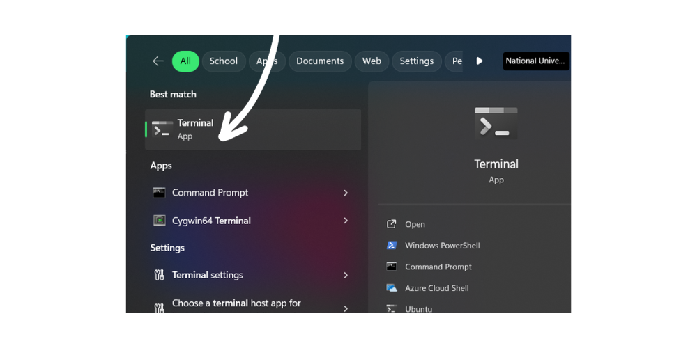
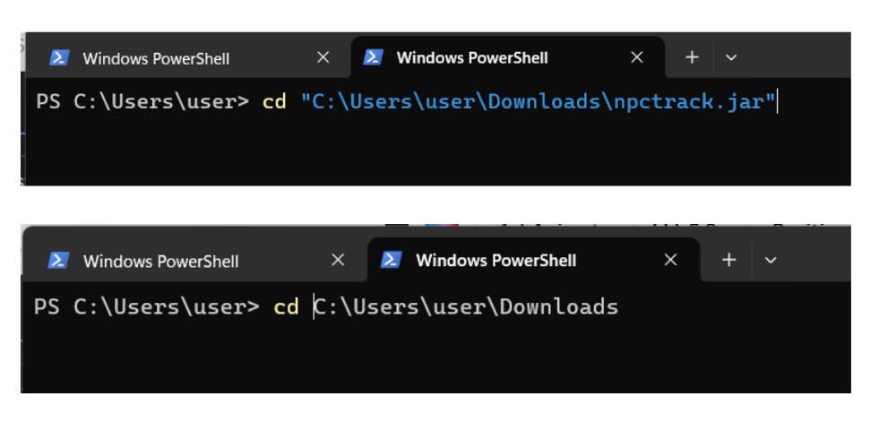
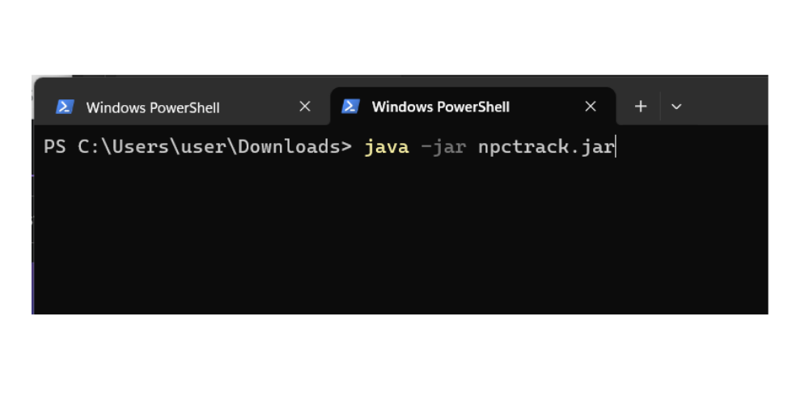
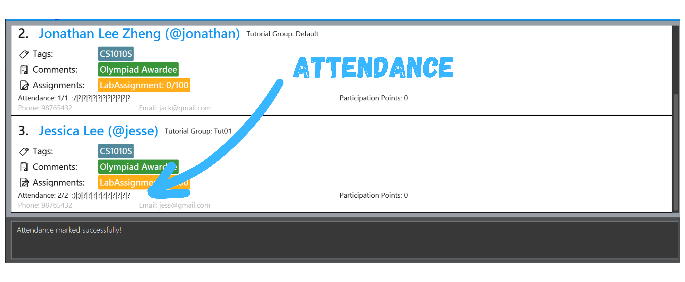
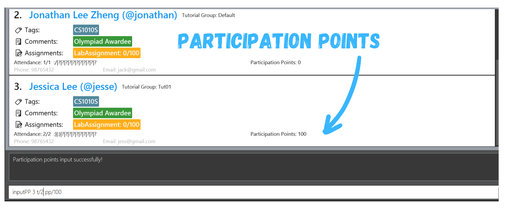
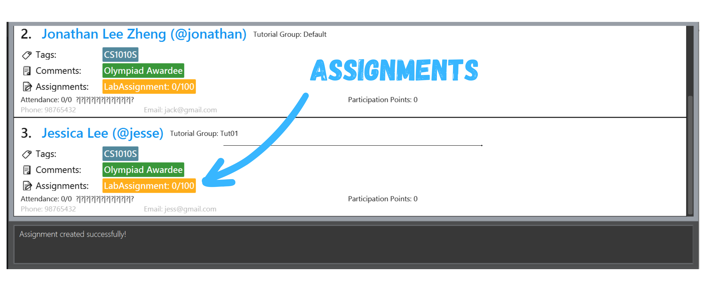
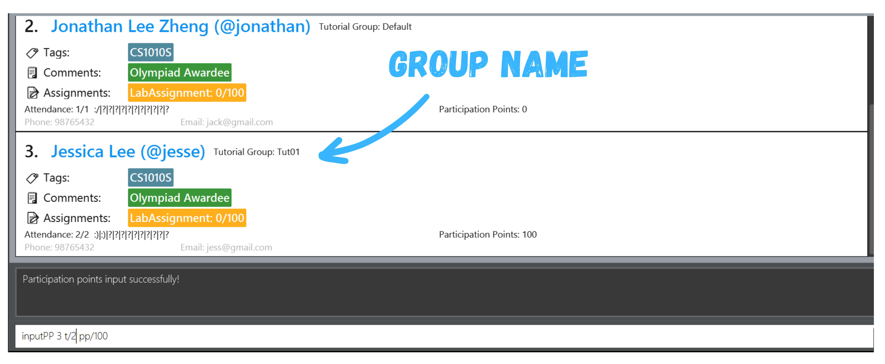

### Making student tracking easy.

`npc_track` is the application for all teaching assistants, streamlining student management processes to help combat the tediousness of keeping track of
student particulars and performance.

Here’s an overview of how `npc_track` can help you streamline your student management process:
- Manage your student contacts (with working Telegram links!)
- Manage tutorial groups!
- Keep track of their attendance and participation levels.
- Keep track of their grades!

But more than that, the application is *simple to use* and efficient. The application allows you to type in commands 
without having to scroll through contacts and lists to click on buttons. The application sports a simple and very readable look!

### How can `npc_track` help you in your teaching journey?

***`npc_track` is for all TA’s, and is adaptable for their management and organisational styles!***

We help teaching assistants to be able to bring together their teaching needs in a hassle-free manner. For instance,
adding extra information for a student named Ted can easily be done using the various keyword features as listed in
our [Features Section](#features)

`npc_track` saves teaching assistant from having to spend so much precious time by reducing the complexity and the
need to navigate different platforms just to search their students. Now, it can be done in a one-stop manner using `npc_track`

Not ready to use `npc_track`? Fret Not, you can jump to the [Quick Start](#quick-start) section to begin your
`npc_track`
journey

If you have used `npc_track` before, you can proceed to the relevant sections via our [Table of Contents](#toc) on
the sidebar

### How can this guide help me?

**First time user?** Welcome and thank you for using our app! This guide will help you in navigating and becoming a 
pro `npc_track` user. If you have yet to install the app, check out the installation guide [here](#quick-start)!

Once you’re done setting up, check out the [features](#features) of `npc_track` to manage your students' info!

If you are an intermediary user and are confused or unclear of some of our features, check out the [FAQ](#FAQ) as well!

Encountered some bugs or unexpected events when using the app? Maybe [Known Issues](#issues) will give you some guidance on what the known bugs (and their status) are!

Need help on memorizing commands? Drop by in [Command summary](#summary)!

---

## Table of Contents

{:toc}

- [Features](#features)

  - [Viewing Help](#help) `help`

  - [Adding a Student](#add) `add`

  - [Editing a Student](#edit) `edit`

  - [Deleting a Student](#delete) `delete`

  - [Listing All Students](#list) `list`

  - [Finding a Student](#find) `find`

  - [Finding a Group of Students](#findGroup) `findGroup`

  - [Distributing Assignments](#assign) `assign`

  - [Distributing Assignments to a Group of Students](#assignGroup) `assignGroup`

  - [Distributing Assignments to an individual](#assignIndiv) `assignIndiv`

  - [Distributing Assignments](#deassign) `deassign`

  - [Grading a Student](#grade) `grade`

  - [Grading a Group of Students](#gradeGroup) `gradeGroup`

  - [Marking Attendance](#markAtd) `markAtd`

  - [Unmarking Attendance](#unmarkAtd) `unmarkAtd`

  - [Marking Attendance for a Group of Students](#markGroupAtd) `markGroupAtd`

  - [Unmarking Attendance for a Group of Students](#unmarkGroupAtd) `unmarkGroupAtd`

  - [Exiting the Program](#exit)

- [FAQ](#FAQ)

- [Known Issues](#issues)

- [Command Summary](#summary)

## Quick start

Step 1 : Ensure you have downloaded [Java](#glossary) version 11 or above in your computer. Here are the steps on 
how to 
download [Java](https://www.oracle.com/java/technologies/downloads/#java11).

Step 2 : Navigate to our [website](https://github.com/AY2324S1-CS2103T-T12-1/tp/releases/tag/v1.3.trial) and download the latest JAR file.

Step 3 : Save the [JAR](#glossary) file to the folder where you want to locate the file. Right click and copy the 
path of where the file is located.

The following steps will be illustrated with **Windows**.
However, the process is the same for **Mac** and **Linux**.

Step 4 : Open your computer's terminal. 

Step 5 : Type in `cd` followed by the location of the file you copied in step 3. Remove the `""` (double quotes) and 
the file name as shown in the figure.  

Step 6 : Type the command `java -jar npctrack.jar` to run the app.

--------------------------------------------------------------------------------------------------------------------

## Navigating `npc_track`

### User Interface
Our user-friendly interface allows quick navigation for teaching assistants. Below is an overview of the interface
followed by a quick summary guide of the User Interface (UI).

| Component               | Function                                                                                           |
|-------------------------|:---------------------------------------------------------------------------------------------------|
| **Command Result**      | The result of the commands that the user types in the command box                                      |
| **Command Box**         | A text box for users to type the various commands as listed in the [Features](#features) section |
| **Student Information** | Summarised information of the student                                       |
| **Student Index**       | The `INDEX` of the student, counting from 1 |

---

## Common Values

| Value      | Description          | Constraints                                                                                                                                                       | Valid Examples                        | Invalid Examples              |
|----------|----------------------|-------------------------------------------------------------------------------------------------------------------------------------------------------------------|---------------------------------------|-------------------------------|
| `n/`     | Names                | Must be alphanumeric and can contain spaces                                                                                                               | John Doe                              | $5money                       |
| `a/`     | Telegram handle      | Must be a-z, 0-9 or underscore.   Minimum Length is 5 characters and maximum 32 characters   Cannot end with an underscore   Must start with a letter | harukaNaruto, loli_pop, l0l1pop       | $telegram, _tele, 56thperson  |
| `group/` | Group names          | Must be alphanumeric and cannot contain spaces   Case sensitive                                                                                       | group1, T01, LEC1                     | $group, _grp, group 1         |
| `p/`     | Phone Numbers        | Must only contain numbers, and it should be at least 3 digits long                                                                                        | 85879384, 0812738239                  | $732642, 62-382914, 321 39812 |
| `e/`     | Email Address        | Must be in valid email format     This is followed by a '@' and then a domain name.                                                                       | email@domain.com, email123@domain.com | email@%domain.com             |
| `t/` (1) | Tags                 | Must only contain alphanumerics                                                                                                                               | validversion                          | #^weirdTags, invalid version  |
| `t/` (2) | Tutorial Number      | An integer between 1 and 12 (inclusive)                                                                                                                           | 1, 2, 3, 12                           | 0, -1, #200                   |
| `c/`     | Comments             | Comments can take any values, and it should not be blank                                                                                                      | Valid Comment                         |                               |
| `s/`     | Status               | The student’s attendance status (case-sensitive).                                                                                                             | P, A, VR                              | p, Absent, VALIDREASON        |
| `pp/`    | Participation Points | An integer between 0 and 1000 (inclusive)                                                                                                                     | 1, 1000, 500                          | points100, 1000pts, -100      |
| `m/`     | Maximum Marks        | An integer between 0 and 1000 (inclusive)                                                                                                                     | 1, 1000, 500                          | 0, -100                       |
| `g/`     | Grade                | A student's marks need to be an integer between 0 (inclusive) and the maximum score of the assignment (inclusive).                             | 1, 1000, 500, 0                       | -100, one-hundred             |

--------------------------------------------------------------------------------------------------------------------

## Features

**:information_source: How to read our commands:** 

* Words in `UPPER_CASE` are the details to be given by the user. 
  e.g. in `add n/NAME`, `NAME` is a detail which can be used as `add n/John Doe`.

* Details in square brackets are optional. 
  e.g `n/NAME [t/TAG]` can be used as `n/John Doe t/friend` or as `n/John Doe`.

* Items with `…`​ after them can be used multiple times or none at all. 
  e.g. `[t/TAG]…​` can be used as ` ` (i.e. 0 times), `t/friend`, `t/friend t/family` etc.

* Details can be in any order. 
  e.g. if the command specifies `n/NAME p/PHONE_NUMBER`, `p/PHONE_NUMBER n/NAME` is also acceptable.

* Extraneous information for commands like (such as `help`, `list`, `exit` and `clear`) will be 
  ignored. 
  e.g. if the command specifies `help 123`, it will be interpreted as `help`.

* If you are using a PDF version of this document, be careful when copying and pasting commands that span multiple lines as space characters surrounding line-breaks may be omitted when copied over to the application.

### Viewing help : `help`

If you have trouble using `npc_track`, simply type the `help` command. The user guide opens in the browser.

:pencil2: **Purpose:**
Helps user navigate through the app.
  
***Format***: `help`

:pushpin: **Having Problems?**
Do not worry! You can refer to our [troubleshooting](#issues) guide for common problems. 
***Confused with some terms?*** You can refer to our [glossary](#glossary) to find out.

:top: [Back to Table Of Contents](#toc)

### Adding a student: `add`

Want to add a student into your student contacts? Give the `add` command a try!

:pencil2: **Purpose:**
Adds a student to the student book.
  
***Format***: `add n/NAME [p/PHONE_NUMBER] [e/EMAIL] [a/TELEGRAM_HANDLE] [t/TAG]… [c/COMMENT]… [group/GROUP]`

:bulb: **Extra Information**
  
- A student can have any number of optional tags
 
- A student can have any number of optional comments
 
- Cannot add a student with the same name in the list. Student names are case-insensitive.
 
- `NAME` : Must be alphanumeric and can contain spaces. 
 
- `PHONE` : Should only contain numbers, and it should be at least 3 digits long. 
 
- `TELEGRAM_HANDLE` : Must be a valid telegram handle ID. 
 
- `GROUP` : A string representing the group of students as shown in the list.  Student group names must be alphanumeric and **cannot** contain spaces.
 
- `TAG` : Must only contain alphanumerics. 
 
- `COMMENT` : Comments can take any values, and it should not be blank.

:pushpin: **Having Problems?**
Do not worry! You can refer to our [troubleshooting](#issues) guide for common problems. 
***Confused with some terms?*** You can refer to our [glossary](#glossary) to find out.

| Examples                                                                                     | Purpose                                                                                      |
|----------------------------------------------------------------------------------------------|----------------------------------------------------------------------------------------------|
| `add n/John Doe p/98765432 e/johnd@example.com a/johnTelegram`                               | Adds John Doe (Telegram : @johnTelegram) with additional details like phone number and email |
| `add n/Betsy Crowe e/betsycrowe@example.com a/newTelegram p/91234567 t/CS2103T c/Quiet Student` | Adds Betsy Crowe  (Telegram : @newTelegram) with extra comments and tags                 |
| `add n/James group/tut4`                                                                     | Adds James while grouping him to `tut4`                                                      |
| `add n/Benson`                                                                               | Adds Benson only                                                                             |

:top: [Back to Table Of Contents](#toc)

### Listing all students : `list`

Want to see all your students' details? Simply type in the `list` command.

:pencil2: **Purpose:**
Shows a list of all students.
  
***Format***: `list`

:pushpin: **Having Problems?**
Do not worry! You can refer to our [troubleshooting](#issues) guide for common problems. 
***Confused with some terms?*** You can refer to our [glossary](#glossary) to find out.

:top: [Back to Table Of Contents](#toc)

### Finding students : `find`

Finding it difficult to scroll through the whole list of students?
If you remember their name, use `find`!

:pencil2: **Purpose:**
Finds students associated with the keyword.
  
***Format***: `find KEYWORD [MORE_KEYWORDS]…`

:bulb: **Extra Information**
  
- `KEYWORD` : Case-insensitive and can involve any character. 

:pushpin: **Having Problems?**
Do not worry! You can refer to our [troubleshooting](#issues) guide for common problems. 
***Confused with some terms?*** You can refer to our [glossary](#glossary) to find out.

| Examples          | Purpose                             |
|-------------------|-------------------------------------|
| `find James Jake` | Finds a student called "James Jake" |

:top: [Back to Table Of Contents](#toc)

### Finding students by group : `findGroup`

Finding it difficult to scroll through the whole list of students?
If you remember their group, use `findGroup`!

:pencil2: **Purpose:**
Finds students associated with the group.
  
***Format***: `findGroup KEYWORD [MORE_KEYWORDS]...`

:bulb: **Extra Information**
  
- `KEYWORD` : Case-insensitive and can involve any character. 

:pushpin: **Having Problems?**
Do not worry! You can refer to our [troubleshooting](#issues) guide for common problems.
***Confused with some terms?*** You can refer to our [glossary](#glossary) to find out.

| Examples      | Purpose                                       |
|---------------|-----------------------------------------------|
| `findGroup 1` | Finds a student in group 1 and lists them out |

:top: [Back to Table Of Contents](#toc)

### Editing a person : `edit`

Have anything you want to change? Fret not, your student details are editable.

:pencil2: **Purpose:**
Edits an existing student.
  
***Format***: `edit INDEX [n/NAME] [p/PHONE] [e/EMAIL] [t/TAG]… [c/COMMENT]… [a/TELEGRAM_HANDLE] [group/GROUP]`

:bulb: **Extra Information**
  
- A student can have any number of optional tags
 
- A student can have any number of optional comments
 
- You cannot add a student with the same name in the list. Student names are case-insensitive.
 
- `INDEX`: A positive integer representing the index of the student as shown in the list.
 
- `NAME` : Must be alphanumeric and can contain spaces. 
 
- `PHONE` : Should only contain numbers, and it should be at least 3 digits long. 
 
- `TELEGRAM_HANDLE` : Must be a valid telegram handle ID. 
 
- `GROUP` : A string representing the group of students as shown in the list.  Student group names must be alphanumeric and **cannot** contain spaces.
 
- `TAG` : Must only contain alphanumerics. 
 
- `COMMENT` : Comments can take any values, and it should not be blank.

:pushpin: **Having Problems?**
Do not worry! You can refer to our [troubleshooting](#issues) guide for common problems. 
***Confused with some terms?*** You can refer to our [glossary](#glossary) to find out.

| Examples                                  | Purpose                                                                                                             |
|-------------------------------------------|---------------------------------------------------------------------------------------------------------------------|
| `edit 1 p/91234567 e/johndoe@example.com` | Edits the phone number and email address of the 1st person to be `91234567` and `johndoe@example.com` respectively. |
| `edit 2 n/Betsy Crower t/`                | Edits the name of the 2nd person to be `Betsy Crower` and clears all existing tags.                                 |
| `edit 3 t/ c/Loves cake`                  | Clears all existing tags of the 3rd person and replaces their tags with "Loves cake".                               |
| `edit 4 group/2`                          | Moves the 4th person to group 2.                                                                                    |

:top: [Back to Table Of Contents](#toc)

### Attendance

For managing attendance, the following commands are available:
* [markAtd](#markAtd)
* [unmarkAtd](#unmarkAtd)
* [markGroupAtd](#markGroupAtd)
* [unmarkGroupAtd](#unmarkGroupAtd)

#### Mark Attendance : `markAtd`

Want to mark a student's attendance? Use the `markAtd` command.

:pencil2: **Purpose:**
Marks the attendance of a student for that tutorial.
  

***Format***: `markAtd INDEX t/TUTORIAL s/STATUS`

:bulb: **Extra Information**
  
- `INDEX`: A positive integer representing the index of the student as shown in the list.
 
- `TUTORIAL`: An integer between 1 and 12 (inclusive).
 
- Marking the attendance for a week that is already marked will result in the message
`This week's attendance has already been marked!`. In addition, the attendance status
list will be updated.

`STATUS`: The student's attendance status (case-sensitive). Valid attendance statuses are as follows:

| Status | Meaning                                                       |
|--------|---------------------------------------------------------------|
| **P**  | Present - If the student shows up for the tutorial.           |
| **A**  | Absent - If the student is absent with no valid reason given. |
| **VR** | VR - If the student is absent with a valid reason (e.g. MC).  |

:pushpin: **Having Problems?**
Do not worry! You can refer to our [troubleshooting](#issues) guide for common problems. 
***Confused with some terms?*** You can refer to our [glossary](#glossary) to find out.

| Examples              | Purpose                                                                      |
|-----------------------|------------------------------------------------------------------------------|
| `markAtd 1 t/1 s/P`   | Marks attendance of student with index 1 and "PRESENT" status for tutorial 1 |
| `markAtd 2 t/12 s/VR` | Marks attendance of student with index 2 and "VALID REASON" for tutorial 12  |

:top: [Back to Table Of Contents](#toc)

#### Unmark Attendance : `unmarkAtd`

Want to unmark a student's attendance? Use the `unmarkAtd` command.

:pencil2: **Purpose:**
Unmark the attendance of a student for that tutorial.
  

***Format***: `unmarkAtd INDEX t/TUTORIAL`

:bulb: **Extra Information**
  
- `INDEX`: A positive integer representing the index of the student as shown in the list.
 
- `TUTORIAL`: An integer between 1 and 12 (inclusive)
 
- Unmarking the attendance for a week that is already unmarked will result in the message
`This week's attendance has already been unmarked!`

:pushpin: **Having Problems?**
Do not worry! You can refer to our [troubleshooting](#issues) guide for common problems. 
***Confused with some terms?*** You can refer to our [glossary](#glossary) to find out.

| Examples           | Purpose                                                    |
|--------------------|------------------------------------------------------------|
| `unmarkAtd 1 t/1`  | Unmark attendance of student with index 1 for tutorial 1  |
| `unmarkAtd 2 t/12` | Unmark attendance of student with index 2 for tutorial 12 |

:top: [Back to Table Of Contents](#toc)

#### Mark Group Attendance: `markGroupAtd`

Want to mark a student's group for their attendance? Use the `markGroupAtd` command.

:pencil2: **Purpose:**
Marks the attendance of a group of students for that tutorial.
  

***Format***: `markGroupAtd GROUP t/TUTORIAL s/STATUS`

:bulb: **Extra Information**
  
- `GROUP`: A string representing the group of students as shown in the list.  Student group names must be alphanumeric and **cannot** contain spaces.
 
- `TUTORIAL`: An integer between 1 and 12 (inclusive)
 
- Marking the attendance for a week that is already marked will result in the message
`This week's attendance has already been marked!`

`STATUS`: The student's attendance status (case sensitive). Valid attendance statuses are as follows:

| Status | Meaning                                                       |
|--------|---------------------------------------------------------------|
| **P**  | Present - If the student shows up for the tutorial.           |
| **A**  | Absent - If the student is absent with no valid reason given. |
| **VR** | VR - If the student is absent with a valid reason (e.g. MC).  |

:pushpin: **Having Problems?**
Do not worry! You can refer to our [troubleshooting](#issues) guide for common problems. 
***Confused with some terms?*** You can refer to our [glossary](#glossary) to find out.

| Examples                 | Purpose                                                               |
|--------------------------|-----------------------------------------------------------------------|
| `markGroupAtd 1 t/1 s/P` | marks attendance of students in group 1 for tutorial 1 as all present |

:top: [Back to Table Of Contents](#toc)

#### Unmark Group Attendance: `unmarkGroupAtd`

Want to unmark a student's group for their attendance? Use the `unmarkGroupAtd` command.

:pencil2: **Purpose:**
Unmark the attendance of a group of students for that tutorial.
  

***Format***: `unmarkGroupAtd GROUP t/TUTORIAL`

:bulb: **Extra Information**
  
- `GROUP`: A string representing the group of students as shown in the list.  Student group names must be alphanumeric and **cannot** contain spaces.
 
- `TUTORIAL`: An integer between 1 and 12 (inclusive)
 
- Unmarking the attendance for a week that is already unmarked will result in the message
`This week's attendance has already been unmarked!`

:pushpin: **Having Problems?**
Do not worry! You can refer to our [troubleshooting](#issues) guide for common problems. 
***Confused with some terms?*** You can refer to our [glossary](#glossary) to find out.

| Examples               | Purpose                                                  |
|------------------------|----------------------------------------------------------|
| `unmarkGroupAtd 1 t/1` | Unmark attendance of students in group 1 for tutorial 1 |

:top: [Back to Table Of Contents](#toc)

### Participation

For participation, you can make the following commands:
* [inputPP](#inputPP)
* [inputGroupPP](#inputGroupPP)
* [listParticipation](#listParticipation)

#### Insert participation points to a student: `inputPP`

Want to reward your student groups with points for their diligent participation? Use the `inputGroupPP` command.

:pencil2: **Purpose:**
Input participation points for a student for that tutorial.
  

***Format***:  `inputPP INDEX t/TUTORIAL pp/POINTS`

:bulb: **Extra Information**
  
- `INDEX`: A positive integer representing the index of the student as shown in the list.
 
- `TUTORIAL`: An integer between 1 and 12 (inclusive)
 
- `POINTS`: An integer between 0 and 1000 (inclusive)
 
- Participation points can only be given for a tutorial that is already marked as attended.
  Else, it will result in the message `Before inputting participation points,
  mark the attendance of the student first!`

:pushpin: **Having Problems?**
Do not worry! You can refer to our [troubleshooting](#issues) guide for common problems. 
***Confused with some terms?*** You can refer to our [glossary](#glossary) to find out.

| Examples                | Purpose                                                                 |
|-------------------------|-------------------------------------------------------------------------|
| `inputPP 1 t/1 pp/350`  | For student with index 1, give 350 participation points for tutorial 1  |
| `inputPP 2 t/12 pp/500` | For student with index 2, give 500 participation points for tutorial 12 |

:top: [Back to Table Of Contents](#toc)

#### Insert participation points to a group of students: `inputGroupPP`

Want to reward your student groups with points for their diligent participation? Use the `inputGroupPP` command.

:pencil2: **Purpose:**
Input participation points for a group of students for that tutorial.
  

***Format***: `inputGroupPP GROUP t/TUTORIAL pp/POINTS`

:bulb: **Extra Information**
  
- `GROUP`: The tutorial group name of the students as shown in the list.  Group names must be alphanumeric and 
**cannot** contain spaces.
 
- `TUTORIAL`: An integer between 1 and 12 (inclusive)
 
- `POINTS`: An integer between 0 and 1000 (inclusive)
 
- Participation points can only be given for a tutorial that is already marked as attended.
  Else, the student(s) with unmarked attendance will not receive any participation points.

:pushpin: **Having Problems?**
Do not worry! You can refer to our [troubleshooting](#issues) guide for common problems. 
***Confused with some terms?*** You can refer to our [glossary](#glossary) to find out.

| Examples                         | Purpose                                                             |
|----------------------------------|---------------------------------------------------------------------|
| `inputGroupPP lab33 t/1 pp/350`  | For students of lab33, give 350 participation points for tutorial 1 |
| `inputGroupPP tut39 t/12 pp/500` | For students of tut39, give 500 participation points for tutorial 12 |

:top: [Back to Table Of Contents](#toc)

#### List participation records: `listParticipation`

Want to check your student's participation details? Not to worry, you can use our `listParticipation` command.

:pencil2: **Purpose:**
List a student's participation record.
  

***Format***: `listParticipation INDEX`

:bulb: **Extra Information**
  
- `INDEX`: A positive integer representing the index of the student as shown in the list.

:pushpin: **Having Problems?**
Do not worry! You can refer to our [troubleshooting](#issues) guide for common problems. 
***Confused with some terms?*** You can refer to our [glossary](#glossary) to find out.

| Examples              | Purpose                                                    |
|-----------------------|------------------------------------------------------------|
| `listParticipation 1` | List the participation record for the student with index 1 |
| `listParticipation 5` | List the participation record for the student with index 5 |

### Assignments

For allocating and grading assignments , you can make the following commands:
* [assign](#assign)
* [deassign](#deassign)
* [deassignIndiv](#deassignIndiv)
* [assignGroup](#assignGroup)
* [assignIndiv](#assignIndiv)
* [grade](#grade)
* [gradeGroup](#gradeGroup)

#### Distribute assignments: `assign`

Keen to assign just all students with a particular assignment? You can use the `assign` command to do that!

:pencil2: **Purpose:**
Create an assignment and assign it to all students.
  

***Format***: `assign n/ASSIGNMENT_NAME m/MAX_SCORE`

:bulb: **Extra Information**
  
- `MAX_SCORE`: An integer between 1 and 1000 (inclusive).
 
- `ASSIGNMENT_NAME`: Case-sensitive. For example, 'Tutorial 1' and 'tutorial 1' are two different assignments.
 
- If the student already has the assignment, assigning the same assignment will overwrite the current assignment.

:pushpin: **Having Problems?**
Do not worry! You can refer to our [troubleshooting](#issues) guide for common problems. 
***Confused with some terms?*** You can refer to our [glossary](#glossary) to find out.

| Examples                   | Purpose                                                                                         |
|----------------------------|-------------------------------------------------------------------------------------------------|
| `assign n/Tutorial1 m/100` | Assigns every student in the list with an assignment called Tutorial1 and a maximum score of 100. |

:top: [Back to Table Of Contents](#toc)

#### Deassign Assignments: `deassign`

Did you accidentally assign the wrong assignment or just want to change the assignment? You can
fix it using the `deassign` command.

:pencil2: **Purpose:**
Delete an assignment for all students.
  

***Format***: `deassign n/ASSIGNMENT_NAME`

:bulb: **Extra Information**
  
- `ASSIGNMENT_NAME`: Case sensitive. For example, 'Tutorial 1' and 'tutorial 1' are two different assignments.

:pushpin: **Having Problems?**
Do not worry! You can refer to our [troubleshooting](#issues) guide for common problems.
***Confused with some terms?*** You can refer to our [glossary](#glossary) to find out.

| Examples      | Purpose                                                                        |
|---------------|--------------------------------------------------------------------------------|
| `deassign n/Tutorial1` | Deletes the assignment called Tutorial1 for all students with that assignment. |

:top: [Back to Table Of Contents](#toc)

#### Deassign Individual Assignments: `deassignIndiv`

Did you accidentally assign a student with the wrong assignment or just want to change the assignment? You can
fix it using the `deassignIndiv` command.

:pencil2: **Purpose:**
Delete an assignment for a particular student.
  

***Format***: `deassignIndiv INDEX n/ASSIGNMENT_NAME`

:bulb: **Extra Information**
  
- `INDEX`: A positive integer representing the index of the student as shown in the list.
 
- `ASSIGNMENT_NAME`: Case sensitive. For example, 'Tutorial 1' and 'tutorial 1' are two different assignments.

:pushpin: **Having Problems?**
Do not worry! You can refer to our [troubleshooting](#issues) guide for common problems.
***Confused with some terms?*** You can refer to our [glossary](#glossary) to find out.

| Examples                      | Purpose                                                          |
|-------------------------------|------------------------------------------------------------------|
| `deassignIndiv 1 n/Tutorial1` | Deletes the assignment called Tutorial1 for the student with index 1 |

:top: [Back to Table Of Contents](#toc)

#### Distribute assignments to a group of students: `assignGroup`

Keen to assign just a group of students with a particular assignment? You can use the `assignGroup` command to do that!

:pencil2: **Purpose:**
Create an assignment and assign it to a group of students.
  
***Format***: `assignGroup GROUP n/ASSIGNMENT_NAME m/MAX_SCORE`

:bulb: **Extra Information**
  
- `GROUP`: The tutorial group name of the students as shown in the list.  Group names must be alphanumeric and 
**cannot** contain spaces.
 
- `MAX_SCORE`: An integer between 1 and 1000 (inclusive).
 
- `ASSIGNMENT_NAME`: Case-sensitive. For example, 'Tutorial 1' and 'tutorial 1' are two different assignments.
 
- If the student already has the assignment, assigning the same assignment will overwrite the current assignment.

:pushpin: **Having Problems?**
Do not worry! You can refer to our [troubleshooting](#issues) guide for common problems. 
***Confused with some terms?*** You can refer to our [glossary](#glossary) to find out.

| Examples                           | Purpose                                                                                |
|------------------------------------|----------------------------------------------------------------------------------------|
| `assignGroup 1 n/Tutorial1 m/100`  | Assigns the group named "1" with an assignment called Tutorial1 and a maximum score of 100.  |
| `assignGroup Phoenix n/Lab1 m/100` | Assigns the group named "Phoenix" with an assignment called Lab1 and a maximum score of 100. |

:top: [Back to Table Of Contents](#toc)

#### Distribute assignments to a student: `assignIndiv`

Keen to assign just one student with a particular assignment? You can use the `assignIndiv` command to do that!

:pencil2: **Purpose:**
Create an assignment and assign it to a student.
  
***Format***: `assignIndiv INDEX n/ASSIGNMENT_NAME m/MAX_SCORE`

:bulb: **Extra Information**
  
- `INDEX`: A positive integer representing the index of the student as shown in the list.
 
- `MAX_SCORE`: An integer between 1 and 1000 (inclusive).
 
- `ASSIGNMENT_NAME`: Case sensitive. For example, 'Tutorial 1' and 'tutorial 1' are two different assignments.
 
- If the student already has the assignment, assigning the same assignment will overwrite the current assignment.

:pushpin: **Having Problems?**
Do not worry! You can refer to our [troubleshooting](#issues) guide for common problems. 
***Confused with some terms?*** You can refer to our [glossary](#glossary) to find out.

| Examples                          | Purpose                                                                          |
|-----------------------------------|----------------------------------------------------------------------------------|
| `assignIndiv 1 n/Tutorial1 m/100` | Assigns student with index 1 with an assignment called Tutorial1 and a maximum score of 100. |
| `assignIndiv 10 n/Lab1 m/100`     | Assigns student with index 10 with an assignment called Lab1 and a maximum score of 100.     |

:top: [Back to Table Of Contents](#toc)

#### Grade assignments: `grade`

Need to give grades to the assignments? You can use our `grade` command to do that.

:pencil2: **Purpose:**
Grade a student's assignment.
  
***Format***: `grade INDEX n/ASSIGNMENT_NAME g/SCORE`

:bulb: **Extra Information**
  
- Need to specify the index of the student after the command word.
 
- `-0` is considered to be 0 in the system. 
 
- `INDEX`: A positive integer representing the index of the student as shown in the list.
 
- `SCORE`: A student's marks need to be between 0 (inclusive) and the maximum score of the assignment (inclusive).
 
- `ASSIGNMENT_NAME`: Case sensitive. For example, 'Tutorial 1' and 'tutorial 1' are two different assignments.

:pushpin: **Having Problems?**
Do not worry! You can refer to our [troubleshooting](#issues) guide for common problems. 
***Confused with some terms?*** You can refer to our [glossary](#glossary) to find out.

| Examples                   | Purpose                                            |
|----------------------------|----------------------------------------------------|
| `grade 1 n/tutorial2 g/80` | Grades the student with index 1 a score of 80 for their tutorial2 assignment. |
| `grade 10 n/lab2 g/35`     | Grades the student with index 10 a score of 35 for their lab2 assignment.     |

:top: [Back to Table Of Contents](#toc)

#### Grade assignments for a group of students: `gradeGroup`

It's tedious to grade the students individually. Try the `gradeGroup` command to collectively grade students in a 
group.

:pencil2: **Purpose:**
Grade a group of students' assignments.
  
***Format***: `gradeGroup GROUP n/ASSIGNMENT_NAME g/SCORE`

:bulb: **Extra Information**
  
- Need to specify the name of the group after the command.
 
- `-0` is considered to be 0 in the system. 
 
- The grade given must be at most the maximum score of every assignment in the group.
 
- Every student in the group must have the assignment. This command pairs well with `assignGroup`.
 
- `GROUP`: The tutorial group name of the students as shown in the list.  Group names must be alphanumeric and 
**cannot** contain spaces.
 
- `SCORE`: A student's marks need to be between 0 (inclusive) and the maximum score of the assignment (inclusive).
 
- `ASSIGNMENT_NAME`: Case sensitive. For example, `Tutorial 1` and `tutorial 1` are two different assignments.

:pushpin: **Having Problems?**
Do not worry! You can refer to our [troubleshooting](#issues) guide for common problems. 
***Confused with some terms?*** You can refer to our [glossary](#glossary) to find out.

| Examples                              | Purpose                                                                                |
|---------------------------------------|----------------------------------------------------------------------------------------|
| `gradeGroup Class33 n/Tutorial1 g/90` | Grades students in the group `Class33` a score of 90 for their `Tutorial1` assignment. |

:top: [Back to Table Of Contents](#toc)

### Changing Student Groups: `group`

If you ever encounter changing group names, you can always use our `group` command to do rename them quickly.

:pencil2: **Purpose:**
Change the student group names.
  
***Format***: `group PREV_GROUP UPDATED_GROUP`

:bulb: **Extra Information**
  
- `PREV_GROUP`: Student group names must be alphanumeric and **cannot** contain spaces.
 
- `UPDATED_GROUP`: Student group names must be alphanumeric and **cannot** contain spaces.

:pushpin: **Having Problems?**
Do not worry! You can refer to our [troubleshooting](#issues) guide for common problems. 
***Confused with some terms?*** You can refer to our [glossary](#glossary) to find out.

| Examples        | Purpose                            |
|-----------------|------------------------------------|
| `group T01 T02` | Changes the group name of `T01` to `T02`. |

:top: [Back to Table Of Contents](#toc)

### Deleting a student : `delete`

Want to remove a student? Use the `delete` command.

:pencil2: **Purpose:**
Deletes the specified person from the student book.
  
***Format***: `delete INDEX`

:bulb: **Extra Information**
  
- `INDEX`: A positive integer representing the index of the student as shown in the list.

:pushpin: **Having Problems?**
Do not worry! You can refer to our [troubleshooting](#issues) guide for common problems. 
***Confused with some terms?*** You can refer to our [glossary](#glossary) to find out.

:top: [Back to Table Of Contents](#toc)

### Exiting the program : `exit`

Done with `npc_track` and want to quit? Use `exit`.

:pencil2: **Purpose:**
Exits the program.
  
***Format***: `exit`

:pushpin: **Having Problems?**
Do not worry! You can refer to our [troubleshooting](#issues) guide for common problems. 
***Confused with some terms?*** You can refer to our [glossary](#glossary) to find out.

:top: [Back to Table Of Contents](#toc)

### Clearing the Data : `clear`

Want to remove all data in your `npc_track`? Do it quickly with `clear`.

:pencil2: **Purpose:**
Clear `npc_track` data.
  
***Format***: `clear`

:exclamation: **Caution:**
Clearing the data will remove all information. Hence, it is recommended to make a backup of the file before clearing 
it. This is irreversible - we require you to type `yes` to confirm.

:pushpin: **Having Problems?**
Do not worry! You can refer to our [troubleshooting](#issues) guide for common problems. 
***Confused with some terms?*** You can refer to our [glossary](#glossary) to find out.

### Saving the data

The data is saved in your system automatically after any command that changes the data. There is no need to save 
manually.

### Editing the data file

`npc_track` data are saved automatically as a [JSON](#glossary) file. Advanced users are welcome to update data 
directly by 
editing that data file.

:exclamation: **Caution:**
If your changes to the data file makes its format invalid, the program will discard all data and start with an empty data file at the next run. Hence, it is recommended to make a backup of the file before editing it.

--------------------------------------------------------------------------------------------------------------------

## Troubleshooting

1. **When using multiple screens**, if you move the application to a secondary screen, and later switch to using 
   only the primary screen, the user interface will open off-screen. The remedy is to delete the `preferences.json` 
   file created by the application before running the application again.

--------------------------

## Command summary

| Action                                | Format, Examples                                                                                                                                                                                                              |
|---------------------------------------|-------------------------------------------------------------------------------------------------------------------------------------------------------------------------------------------------------------------------------|
| **Add**                               | `add n/NAME p/[PHONE_NUMBER] e/[EMAIL] a/[TELEGRAM_HANDLE] [t/TAG]… [c/COMMENT]… [group/GROUP]`   e.g., `add n/James Ho p/92224444 e/jamesho@example.com a/jamesTele t/CS2103T t/CS2103R c/Owes an assignment group/tut33` |
| **Clear**                             | `clear​`                                                                                                                                                                                                                      |
| **Confirm Clear**                     | `yes`                                                                                                                                                                                                                         |
| **Deassign Assignments**              | `deassign n/ASSIGNMENT_NAME`                                                                                                                                                                                                  |
| **Deassign Individual Assignments**   | `deassignIndiv INDEX​ n/ASSIGNMENT_NAME`                                                                                                                                                                                       |
| **Delete**                            | `delete INDEX​`   e.g., `delete 3`                                                                                                                                                                                         |
| **Distribute Assignments**            | `assign n/ASSIGNMENT_NAME m/MAX_SCORE`                                                                                                                                                                                        |
| **Distribute Group Assignments**      | `assignGroup GROUP n/ASSIGNMENT_NAME m/MAX_SCORE`                                                                                                                                                                             |
| **Distribute Individual Assignments** | `assignIndiv INDEX n/ASSIGNMENT_NAME m/MAX_SCORE`                                                                                                                                                                             |
| **Edit**                              | `edit INDEX [n/NAME] [p/PHONE] [e/EMAIL] [t/TAG]… [c/COMMENT]… [group/GROUP]`   e.g., `n/New Name t/`                                                                                                                                   |
| **Exit**                              | `exit​`                                                                                                                                                                                                                       |
| **Find**                              | `find KEYWORD [MORE_KEYWORDS]...` e.g., `find James Jake`                                                                                                                                                                     |
| **Find Group**                        | `findGroup KEYWORD [MORE_KEYWORDS]...` e.g., `findGroup group1 group2`                                                                                                                                                        |
| **Grade Assignments**                 | `grade INDEX n/ASSIGNMENT_NAME g/SCORE`                                                                                                                                                                                       |
| **Grade Group Assignments**           | `gradeGroup GROUP n/ASSIGNMENT_NAME g/SCORE`                                                                                                                                                                                  |
| **Group**                             | `group PREV_GROUP UPDATED_GROUP`                                                                                                                                                                                              |
| **Help**                              | `help​`                                                                                                                                                                                                                       |
| **Input Group Participation Points**  | `inputGroupPP GROUP t/TUTORIAL pp/POINTS`                                                                                                                                                                                     |
| **Input Participation Points**        | `inputPP INDEX t/TUTORIAL pp/POINTS`                                                                                                                                                                                          |
| **List**                              | `list​`                                                                                                                                                                                                                       |
| **List Participation Record**         | `listParticipation INDEX`                                                                                                                                                                                                     |
| **Mark Attendance**                   | `markAtd INDEX t/TUTORIAL s/STATUS`                                                                                                                                                                                           |
| **Mark Group Attendance**             | `markGroupAtd GROUP t/TUTORIAL s/STATUS`                                                                                                                                                                                      |
| **Unmark Attendance**                 | `unmarkAtd INDEX t/TUTORIAL`                                                                                                                                                                                                  |
| **Unmark Group Attendance**           | `unmarkGroupAtd GROUP t/TUTORIAL`                                                                                                                                                                                             |

--------------------------------------------------------------------------------------------------------------------

## Glossary

| Keyword                     | Definition                                                                           |
|-----------------------------|--------------------------------------------------------------------------------------|
| **Parameter**               | Details about the student that will be included in the command                       |
| **Command**                 | Instructions that `npc_track` will execute                                           |
| **JAR**                     | Compressed file of `npc_track` is in the form of a Java ARchive                      |
| **Java**                    | Programming language used to develop `npc_track`                                      |
| **JSON**                    | Lightweight file format for storing and transferring data                            |
| **Attendance status**       | The student's attendance status which can be "present", "absent", or "valid reason". |
| **Attendance status: `:)`** | The emoji associated with "present".                                                 |
| **Attendance status: `x`**  | The emoji associated with "absent".                                                  |
| **Attendance status: `:/`** | The emoji associated with "valid reason".                                            |

## FAQ

**Q**: How do I transfer my data to another Computer? 
**A**: Install the app in the other computer and overwrite the empty data file it creates with the file that contains the data of your previous StudentBook home folder.

**Q**: There are 12 tutorials on the attendance list, but my module has less than 12 tutorials per sem. 
**A**: In a typical semester, there are 13 weeks. Tutorials can start earlier or later, so to accomodate the largest possible number of tutorials, npc_track
has 12 weeks' worth of tutorials to grade.

**Q**: I have two students that share the exact same name. How can npc_track support this? 
**A**: npc_track cannot handle students with the exact same name. However, you can consider adding something else to their names to distinguish between them.
So for example, if you have 2 students called "Arnab Goav", you can name one student "Arnab Goav 1" and the other "Arnab Goav 2".

**Q**: The user display looks weird when I add a very long name or minimise it to very small sizes. 
**A**: npc_track does not support extreme inputs. It is optimised for sane usage with a standard screen size and normal names. We will add support in a future version.

**Q**: I can enter two students with the same telegram handle or same phone number (or something similar). Why is this allowed? 
**A**: npc_track allows this, much like a normal contacts application in your phone. We do not enforce too many checks as we want to enable
our users to use our app how they like, and support various unforeseen scenarios.

